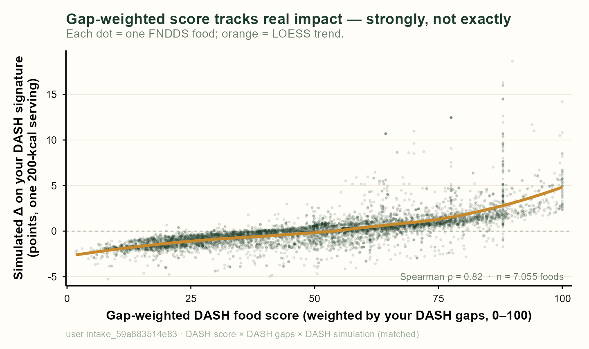

::: {.callout-note}
**Draft / working case study.** The numbers below are a first pass on a *single*
real user under *one* index (DASH). The point of the draft is the method and the
research program it opens, not the specific coefficients. Everything is
reproducible from the harness noted at the end.
:::

Every food-rating system answers the same question the same way: with one number.
Nutri-Score says this food is a C. NOVA says it's ultra-processed. A supermarket
app gives it 4.2 stars. The number is the same whoever is standing in the aisle.

FRESH asks a different question. Not *how good is this food in the abstract*, but
*what would this food do to **your** diet* — simulated, by adding a realistic
serving to what you already eat and re-scoring your whole signature. That answer
is a **change**, and it is personal: a food that closes one person's gap can be a
rounding error for someone who already eats it.

So there are two objects in play — a **score** (how good the food looks) and a
**simulated effect** (what the food actually does to a specific person). This case
study is a first attempt to measure how far apart they are, and it turns out the
distance has structure worth naming.

## The setup

Take one real Cronometer logger. For every one of the 7,055 foods in the USDA
FNDDS database, compute two things:

- a **food-quality score** — the food's DASH component profile, collapsed to a
  0–100 number. In one version every component counts equally (**generic**); in
  another, each is weighted by how far *this* user is from ideal on it
  (**gap-weighted** — the food is graded on the axes the user most needs).
- the **simulated effect** — add a 200-kcal serving of that food to the user's
  logged diet and measure how much their DASH signature actually moves.

Then ask the simple question: *does the score predict the effect?*

## What one user looks like

{#fig-scatter fig-alt="Scatter of 7,055 foods: simulated DASH effect rises monotonically with gap-weighted DASH score, Spearman 0.82, with widening vertical spread at high scores."}

Three things are visible at once (@fig-scatter):

- **The score is a strong sorter.** The relationship is monotone and tight-ish —
  Spearman ρ ≈ 0.82. Rank foods by the score and you have largely ranked them by
  real impact. As a *filter* to shortlist candidates before the expensive
  simulation, the score earns its keep.
- **It's a filter, not an answer.** At any given score the effect is a *band*, not
  a point. Around the middle of the range a food's simulated effect might be −1 or
  +1.5; near the top it might be 0 or +8. The score narrows the field; it does not
  pin the number. The best foods can only be separated by simulating them.
- **There's a natural helps/hurts line.** The trend crosses zero near the middle
  of the score. Below it, adding the food *slightly worsens* the diet; above it,
  it helps. A food score has a real threshold hiding in it.

That last point is the seed of a sharper question we come back to below: *at what
score can you promise a food will help?*

## Twist one: the score has to speak your language

The obvious way to personalize a food score is to weight it by the eater's gaps —
grade the food on the axes they're worst on. When we tried it, the personalized
score sometimes correlated *worse* with real impact than the plain generic one.
That looked wrong: more information about the person shouldn't hurt.

The catch was a framework mismatch. This user's diet is scored under **low-carb
DASH**, but the food score was built on the **DASH** axes. Measured
apples-to-apples — DASH score against a DASH-framework simulation — gap-weighting
*helps* (ρ 0.76 → 0.82 across foods). Measured against the user's *actual*
low-carb-DASH objective, the DASH-based score is simply the wrong yardstick, and
gap-weighting it made it *more* confidently wrong.

The fix is to score the food in the eater's own framework. Do that, and both moves
stack: matching the framework lifts correlation with the real objective from ~0.63
to ~0.77, and gap-weighting *on top of the matched framework* lifts it again to
~0.85. A food-quality score is only personal if it's computed in the index the
person is actually being judged by.

## Twist two: why personalizing can backfire

The mechanism is worth stating because it's a general trap. A gap weight measures
*how far you are from a framework's ideal* — which is only a good proxy for *how
much improving an axis would help* when the framework matches the objective.

This user eats low-carb and high-fat. On DASH — which punishes fat — they look
maximally deficient on exactly the fat, cholesterol, and sodium axes. So a
DASH-gap-weighted score pours weight onto those axes. But their real (low-carb)
objective barely cares about total fat and *inversely* values sodium. Checked
axis by axis, the single highest DASH gap-weight (total fat, weight 1.0) is the
*worst* predictor of their real improvement (correlation ~0.09), sodium is
*negatively* related, and protein — which the DASH gaps zero out entirely — is
genuinely relevant. Gap-weighting faithfully amplified the wrong framework's
priorities. Personalization only helps when it's *your* framework's gaps.

## Why this is the whole FRESH bet, in miniature

A generic food-rating system gives one verdict to everyone. What this exercise
shows, even at n = 1, is that the *real* value of a food is (a) a distribution, not
a point, and (b) framework- and person-specific. The score is a useful compression
of that — a fast filter — but the thing people actually want to know ("is this
good *for me*?") lives in the spread the score throws away.

If that's true, it should be *measurable at scale*: the same food should earn
visibly different verdicts across different people, and the spread should be
larger than any generic rating system could ever represent. That's the program.

## Where this goes next

This draft is step one. The open questions, roughly in order of leverage:

1. **Beyond DASH.** Re-run the score-vs-simulation correlation across every index
   in the FRESH library (HEI, AHEI, MIND, Mediterranean, low-carb DASH…). Does the
   "matched framework + gap-weighting" result generalize, or is DASH special?

2. **Beyond one user.** Repeat across many loggers and look for *trends*, not a
   single coefficient. Does gap-weighting help everyone, or only people whose diet
   diverges from the index (like our low-carb user)?

3. **The promise threshold.** For each user, find the score cutoff above which
   **≥95% of foods have a positive simulated impact** — the point where the filter
   can *honestly promise* "this will help." Compare that cutoff, and how many foods
   survive it, for the **generic vs the personalized** score. A better-personalized
   score should hit the 95%-positive line at a lower cutoff (keeping more good
   options) — a concrete, decision-relevant measure of personalization's value.

4. **Whole populations.** Compute these curves for **everyone in NHANES** (a
   nationally representative diet distribution) and for **everyone in our own
   Cronometer logs**. What does the distribution of thresholds, correlations, and
   gap-weighting benefit look like across a real population?

5. **The headline experiment — one food, a thousand verdicts.** Take a *single*
   food. Simulate its effect across **~1,000 people**, under **two dietary
   indices**, using **all three ways FRESH evaluates health** (the food's own
   quality score, the person's gap-weighted score, and the full iso-caloric
   simulation). Plot the spread. The claim we expect to land: the same food is a
   real gain for some people and a wash-or-worse for others — and that spread is
   invisible to any one-number food-rating system (Nutri-Score, NOVA, a star
   rating). This is the figure that makes the FRESH thesis undeniable: *food
   healthfulness is a distribution over people, and we can draw it.*

6. **Serving-size sensitivity.** Every simulated effect above uses a
   standardized 200-kcal dose. Real eating occasions vary enormously by food —
   and the score is dose-free while the simulation is dose-dependent. Re-run
   the correlation under three dose regimes (per-calorie standardized, per-gram
   standardized, and realistic food-specific servings) and measure how much of
   the "filter, not answer" band is *dose* rather than composition — and where
   the promise threshold moves once servings are honest.

7. **Are the cutpoints even right?** The food-level scoring anchors behind the
   x-axis are hand-set — and they differ between DASH and low-carb DASH *on
   purpose* (a deliberate "less aggressive" pass in the original prototype that
   was never validated). Two experiments: perturb each anchor and measure how
   sensitive the score↔impact correlation is to it; then invert the question —
   treat the anchors as free parameters and *tune* them to maximize the
   correlation between the (generic or personalized) score and the simulated
   benefit, validated out-of-user. The tuned anchors are the food-level
   cutpoints most faithful to the engine's own objective — and a direct test of
   whether the prototype's hand-set choices were right.

## Reproducibility

The one-user pass here comes from two small, parameterized harnesses in the
`fresh_diet` repo:

- `tools/eval/prefilter_experiment.R` — computes generic and gap-weighted food
  scores (DASH and framework-matched), the simulated effect per food, and the
  rank correlations / recall curves. Runs per user via `--intake`.
- `tools/eval/plot_prefilter.R` — the scatter in @fig-scatter.

Everything downstream (items 1–5) is a widening of the same loop: more indices,
more users, the population sources, and the thousand-person spread.
