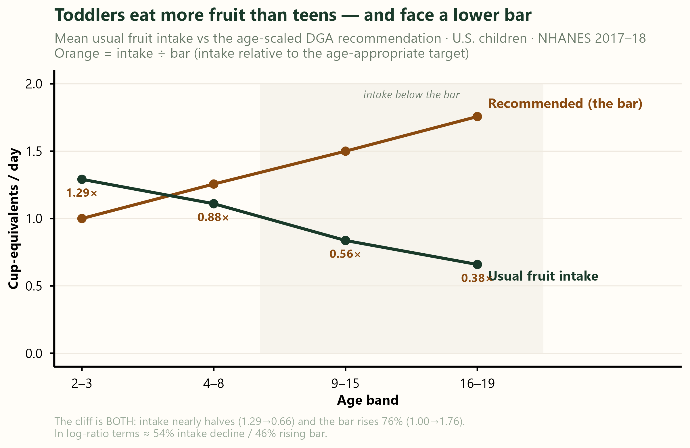
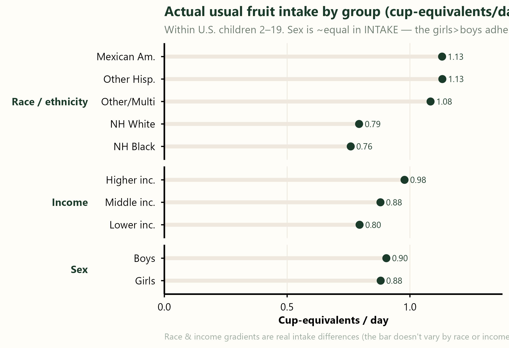
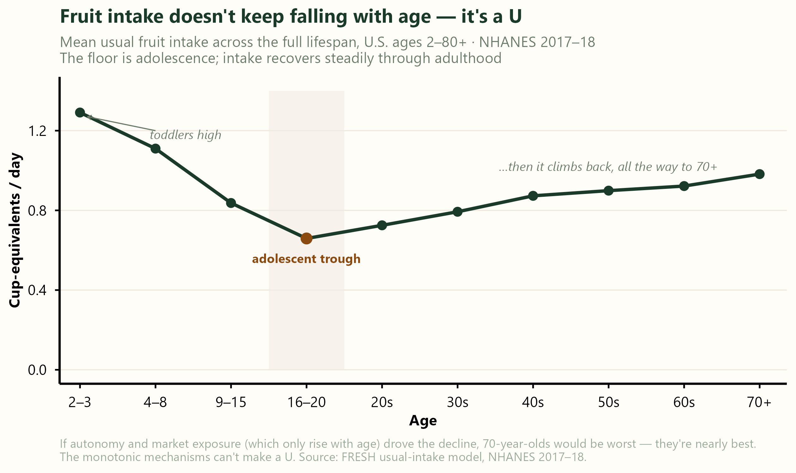

This is the companion note to [the main essay](../not-the-price-of-fruit/index.html). The headline stands on its own; everything here is the tire-kicking — the checks a careful reader (or reviewer) would want before believing the cliff. The short version: the main story survives all of them, and a couple turned up something worth knowing.

## The subgroup numbers in full

The main essay shows the habitual estimates as a figure. Here is the full table — both estimands (habitual usual-intake and per-day compliance), every subgroup within children 2–19.

| Children 2–19 | Habitual | Per-day |
|---|---|---|
| **All children** | **21.9** | **18.1** |
| Age 2–3 | 61.3 | 48.5 |
| Age 4–8 | 37.3 | 30.4 |
| Age 9–15 | 14.5 | 12.2 |
| Age 16–19 | 6.3 | 6.0 |
| Boys | 18.6 | 14.9 |
| Girls | 25.4 | 21.5 |
| Mexican American | 30.9 | 26.5 |
| Other Hispanic | 30.4 | 24.6 |
| Non-Hispanic White | 18.1 | 15.2 |
| Non-Hispanic Black | 16.5 | 12.9 |
| Other / Multiracial | 29.8 | 23.3 |
| Lower income (PIR <1.3) | 18.2 | 15.1 |
| Middle (PIR 1.3–3.5) | 21.6 | 18.0 |
| Higher income (PIR ≥3.5) | 24.9 | 20.4 |

: % meeting the fruit recommendation, U.S. children, NHANES 2017–18. Habitual = small-area usual-intake model; per-day = small-area per-day compliance. All cells carry 90% intervals. {.striped}

## Per-day or habitual: which question is the guideline even asking?

The table above carries two columns — habitual and per-day — and they answer different questions.

Start with the daily reading. The Dietary Guidelines are written as a daily target — *this many cups per day*. Taken at its word, that's a question about days: on a given day, did you hit the mark? The field usually doesn't answer it that way. To keep a single lucky or unlucky recall day from speaking for a person, the convention — USDA's included — is to model *habitual* intake, the long-run average, and ask whether that clears the bar.

Both are defensible, and they're different questions. For an episodic food, the two need not agree — here they land within a few points of each other, but that isn't guaranteed. And the guideline's own wording arguably fits the daily reading at least as well as the habitual one — yet the single number you usually see has quietly picked one without telling you which. That's why we report both, and lead with the habitual one (it's the convention, and what USDA-ERS uses).

## Is the age cliff just the moving recommendation?

The obvious objection: the fruit recommendation isn't fixed — it climbs from about one cup for a toddler to two for a teenager, because energy needs climb. So is the adherence cliff just the bar getting harder, not kids eating less? We pulled the actual usual-intake estimates to find out.

| Age | Usual intake (cup-eq) | Recommended bar | Intake ÷ bar | Adherence |
|---|---|---|---|---|
| 2–3 | **1.29** | 1.00 | 1.29× | 61% |
| 4–8 | 1.11 | 1.26 | 0.88× | 37% |
| 9–15 | 0.84 | 1.50 | 0.56× | 15% |
| 16–19 | **0.66** | 1.76 | 0.38× | 6% |

: Usual fruit intake vs the age-scaled recommendation, U.S. children, NHANES 2017–18. {.striped}

Both things are true at once. Absolute intake **nearly halves** (1.29 → 0.66 cup-eq), *and* the bar rises 76%. Decomposing the collapse in intake-relative-to-target on the log scale, it's roughly **54% real intake decline, 46% rising bar**. So the moving recommendation is a big part of the story — but it can't carry it alone. Even against a frozen toddler-level bar, teens would still fall short. Toddlers genuinely eat about twice the fruit that teenagers do — frozen bar or not.

This is exactly why the main essay treats age as *where the gap lives*, not *why* — and it's the honest answer to "isn't this just the bar?": partly, but not mostly.

## The boys-vs-girls gap is mostly the bar

Here the check changed our reading. In the main table, girls clear the recommendation more often than boys (25% vs 19%). The natural inference is that girls eat more fruit. They don't.

In fact, girls' mean usual intake (0.88 cup-eq) is *slightly lower* than boys' (0.90). The adherence gap exists because girls get a **lower recommendation** (1.5 vs 2.0 cup in the older bands) — they clear a lower bar with the same fruit. The boys/girls adherence gap is a denominator effect, not a behavioral one.

Race and income are the opposite — **real intake differences**, because the bar doesn't vary by race or income. Mexican-American and other Hispanic children eat ~1.13 cup-eq, against ~0.76–0.79 for non-Hispanic White and Black children; intake climbs from 0.80 (lower-income) to 0.98 (higher-income). Those gaps are about fruit, not about the bar.

## Which energy do you adjust by? (It matters.)

Because the recommendation is energy-scaled, you can normalize fruit intake two ways: by a **reference** energy need (a standard moderately-active person of that age and sex — what USDA-ERS does, and what we do), or by each person's **own reported** energy from the 24-hour recall.

We use the reference, deliberately. Reported energy is systematically **under-reported**, and unevenly — under-reporting is worst in adolescents and higher-BMI individuals, while toddlers' intake is caregiver-reported and more complete. Normalizing by reported energy hands the worst under-reporters an artificially low bar, which *inflates* their apparent adherence — and since teens under-report most, it would quietly **flatten the very cliff we're trying to measure.** Usual-intake modeling cleans up day-to-day noise, but it does not fix this kind of systematic bias; only an external calibration (a biomarker like doubly-labeled water) would, and we don't have one here.

So the `intake ÷ bar` column above is an energy-adjusted view that leans only on *reference* energy — no recall error in the denominator. That's the robust way to ask the question, and it still shows the cliff.

## Is it a juice story? (No — we checked.)

The tempting explanation is juice: toddlers drink it, teenagers switch to soda, and the "fruit" cliff is really a juice cliff. The pipeline already carries the components — `F_JUICE` alongside total fruit, plus the 100%-orange-juice counterfactual from our published OJ work — so this is checkable, not speculative. It isn't a juice story.

| Age | Total | Juice | Whole | of which OJ |
|---|---|---|---|---|
| 2–3 | 1.16 | 0.37 | 0.79 | 0.04 |
| 4–8 | 1.30 | 0.43 | 0.87 | 0.15 |
| 9–15 | 0.95 | 0.25 | 0.70 | 0.09 |
| 16–19 | 0.79 | 0.26 | 0.53 | 0.13 |
| *decline 4–8→16–19* | *−40%* | *−39%* | *−40%* | *−15%* |

: Day-1 mean fruit (cup-eq), U.S. children, NHANES 2017–18. Descriptive (raw recall, not the usual-intake model), so values won't match the adherence figures exactly. {.striped}

Juice and whole fruit fall in **lockstep** — both down about 40% from the early-childhood peak to the late teens — and juice holds a roughly constant third of fruit at every age. So the cliff is a broad, whole-diet decline, not a single beverage being weaned away. (That, if anything, *reinforces* the social-transition reading: it's the whole food environment shifting, not one drink.)

One component bucks the trend: **100% orange juice falls only 15% while everything else falls 40%**, rising from 4% of toddlers' fruit to 16% of teenagers'. As the fruit cliff deepens, OJ is disproportionately what's left — a thread that ties straight back to our OJ paper and is worth a dedicated follow-up (built on usual-intake models, not these raw day-1 means).

## The decline isn't one-way: fruit intake is U-shaped

The main essay stays with children, and for the child decline *alone* the usual explanations (autonomy, declining parental support, the peer-and-market environment) are hard to rule out — they all move the right way. But widen the lens to the whole lifespan and a wrinkle appears that they don't obviously survive.

That wrinkle is the shape of the lifespan curve: fruit intake doesn't keep falling with age. It bottoms out in adolescence and then climbs back through adulthood — by the 70s nearly to early-childhood levels, well above the teenage floor. That's a problem for the tidy story. Autonomy, market exposure, and the absence of a parent cutting up your fruit all *increase* with age — and a cause that rises monotonically can't produce a U. If those were the whole account, 70-year-olds — maximal autonomy, a lifetime of market exposure — would be the worst; instead they're nearly the best.

So either something specific to the adolescent window is doing work the standard list misses, or the recovery is driven by something else. Two honest possibilities we can't separate from a single cross-section:

- an **age** effect — health concern, routine, and means rising into adulthood (the same kind of behaviors USDA's drivers model flags); or
- a **cohort** effect — older Americans grew up eating more fruit and kept the habit.

That's the age–period–cohort confound, and one survey snapshot can't resolve it. Either way it does the same thing to the easy explanation: it rules out "autonomy and the market" as a *complete* account — which is why the main essay leaves the *why* behind the cliff genuinely unsettled rather than closed.

## What this note doesn't settle

- **The decomposition is mean-based.** Adherence is a tail probability, `P(usual ≥ bar)`, so it also depends on how the spread of usual intake changes with age — not just the mean. A full counterfactual (recompute adherence holding the bar fixed) is the cleaner test.
- **Intake estimates here are from the two-part (gamma) engine**; the main essay's adherence uses the Box-Cox MRP. The means are close, but we'd recompute on one engine for a final figure.
- **Differential under-reporting cuts both ways.** It biases the reported-energy bar (above), but it also touches the fruit numerator itself — teens likely under-report fruit too, which would push the other direction. Neither is fixable without a calibration sub-study.

None of these move the headline: the gap lives in age, age is a container not a cause, and cost is a second-order lever. They just mark where the real work — the *why* — begins.

---

*Analysis: FRESH dietary surveillance and equity pipeline (NCI two-part · Box-Cox MRP).*
