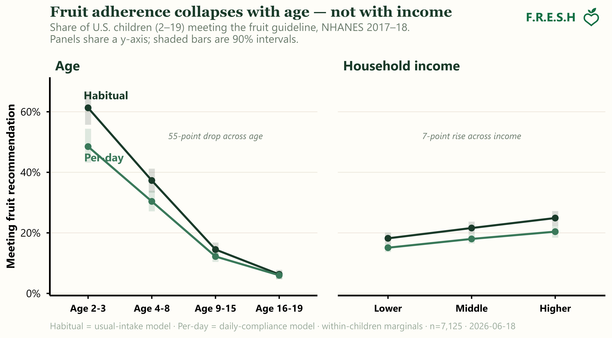

USDA reports that about 23% of American children get enough fruit. The number is right.

It's also close to useless if your job is getting more kids to eat fruit. And it quietly props up a story that doesn't hold.

Because "23% of children" is the average of a population where roughly **6 in 10 toddlers** clear the bar and about **6 in 100 teenagers** do. The word "children" is hiding a cliff.

## First you reproduce the number. Then you get to argue with it.

USDA's Economic Research Service recently published its fruit-consumption trends report (ERR-341).[^ers] It uses the National Cancer Institute's usual-intake method — the right tool. It models *habitual* intake instead of naively averaging two recall days, and it respects the survey design. For 2017–March 2020 it reports 14.7% of adults and 23.2% of children meeting the fruit recommendation.

Building from our previous work[^oj], and before I trusted our own pipeline to say anything ERS didn't, I wanted it to agree where ERS already had an answer. So I estimated the same quantity on NHANES three ways: the NCI two-part method (13.8% overall), a multilevel small-area model — the kind political scientists use to estimate opinion in all 50 states from one national poll (14.6%) — and a small-area model of per-day compliance (12.1%).

| Population (NHANES 2017–18) | USDA-ERS[^win] | NCI 2-part (ours) | Small-area model (habitual) | Small-area model (per-day) |
|---|---|---|---|---|
| Children 2–19 | 23.2 | — | 21.9 | 18.1 |
| Adults 20+ | 14.7 | — | 12.4 | 10.4 |
| Total 2+ | 16.6[^blend] | 13.8 | 14.6 | 12.1 |

: Three engines, sitting on top of a fourth from USDA. (% meeting the fruit recommendation.) {.striped}

*Source: FRESH usual-intake pipeline (NCI two-part · Box-Cox MRP), NHANES 2017–18; USDA-ERS column from ERR-341.*

Same neighborhood, three engines, matching USDA. The agreement is the least interesting thing in this post. It's the price of admission.

## The estimator isn't the problem. The resolution is.

I want to be precise here, because it's easy to strawman: USDA is *not* doing this wrong. They use usual intake. They split children from adults. The public tables are honest.

The problem is that the unit of reporting — "children," "adults" — is far coarser than the unit of action. Nobody designs a fruit campaign for "children." They design it for 4-year-olds, or for teenagers, or for a specific income tier in a specific community. And the moment you look at *that* resolution, the single number dissolves into something far more useful.

.](cliff_by_subgroup.png)

The age cliff dominates the figure, but the gap keeps splitting below the child-vs-adult line that usually gets reported: girls clear the bar more than boys[^sexbar], Hispanic and multiracial kids run nearly double non-Hispanic White and Black kids, and adherence climbs monotonically with income.

None of that is visible in "23%." All of it is in the same data.

## "Fruit is expensive" explains less than you'd think

The standard explanation for a gap like this is cost, and it deserves to be taken seriously. A widely cited meta-analysis put the healthiest diets at about \$1.50 a day more than the least healthy ones[^rao], and affordability anchors much of the ultra-processed-food debate: lower-income families, the argument goes, can't afford fresh produce, so you can't simply tell them to trade chips for fruit[^acc]. There's real evidence behind the worry.

And there *is* an income gradient here — lower-income kids at 18%, higher-income at 25%. The story isn't wrong. It's just small.

Put it next to the age cliff and it nearly disappears. The age gap is 55 points; income is 7. The income gradient is about **12 cents on the dollar** of the age gradient, and that holds whether you measure in points or in ratios (≈10× across age, ≈1.4× across income).

It also can't explain who's actually winning. The highest-adherence kids in the country aren't the richest — they're Mexican-American kids (31%), well ahead of non-Hispanic White kids (18%), who are on average higher-income. Income isn't even the through-line within the gradient: non-Hispanic Black kids are low (consistent with the cost story), but Hispanic kids are the highest in the country (the opposite of it). One variable doesn't move both directions.

USDA's own report reaches the same conclusion from the other side. In their model, household income and fruit prices have *less* influence on whether someone meets the recommendation than behaviors that signal concern for health and nutrition knowledge.[^ersdrivers]

None of this says cost doesn't matter — Rao's \$1.50 is real, food deserts are real, and a 37% relative gap by income is worth closing. It says that for *this* gap, in *fruit*, cost is a second-order lever. Reach for "they can't afford it" first and you're tuning the smallest dial on the board — stepping over a 55-point age collapse to do it.

## But "age" isn't an answer either

So if it isn't price, is it age? Not really. "Age" is a container, not a cause — knowing the gap lives in teenagers tells you *where* to look, not *why* it's there. And part of the cliff isn't behavior at all: the recommendation itself climbs from about one cup for a toddler to two for a teenager, so the bar rises at the very moment intake falls. The raw age effect quietly mixes a moving target with a real decline.[^barnote]

Pull those apart and the obvious explanations are social ones, easy to reach for. The literature (a quick, non-systematic read — this is an essay, not a manuscript) has a familiar list for why fruit fades from childhood to adolescence: parents stop cutting it up and handing it over, kids gain autonomy over their own plates, home availability drops, peers and the market move in.[^lit] Toddlers are handed fruit; somewhere in adolescence they take the plate over, and fruit slides off it. It's a plausible story — I'm just not sure it's the whole one. (It isn't simply a switch off juice, at least: juice and whole fruit fall together. And the [companion note](../not-the-price-of-fruit-notes/index.html) turns up a longer-range pattern the tidy autonomy-and-market story doesn't obviously survive.)

And it's worth asking what *kind* of variable "age" is here. Part of the rising bar is plainly biological — bigger bodies need more food. But the fruit *falling off the plate* seems to be something else. Nothing in a teenager's physiology rejects an apple; what changes looks social — who controls the plate, what's in the vending machine, what a snack signals among friends, what the market is selling. If that read is right, the cliff is a social transition wearing a biological variable's clothing.

Which makes the way we usually handle age a little strange. Much of geroscience treats it as *the* thing to measure — epigenetic clocks, biological-age scores, age read off the body to a decimal. A lot of health-inequality research does closer to the opposite, age-standardizing to net age *out* so the "real" social variables can show through. (Nutrition and life-course researchers *do* take the age decline seriously — to be fair — so this isn't "nobody looks"; the narrower point is how age gets handled once the frame is *inequality*.) Either way, the fruit cliff is a social gradient that one tradition over-measures as biology and the other adjusts away — and, at least in these data, it may be the steepest one in the picture. That seems like a variable to study, not to adjust away. And it isn't only fruit, or only children: the same lens would change how we read income, race, even old age — each of which we tend to treat as fixed when it's at least partly built.

## Design the estimate for the decision, not the press release

The aggregate "14%" or "23%" isn't really a measurement. It's a measurement collapsed to one number so it fits in a sentence. That's fine for a headline and useless for a campaign.

If you're testing a message, you don't need the average. You need to know the gap lives in teenagers, barely moves with income, and doesn't follow the affordability script at all — and you need the estimate built at *that* resolution, with honest uncertainty, on a survey that was never designed to be sliced this thin. That's a design problem: build the estimate to answer the targeting question you actually have, not the one that fits the press release — or the one that fits your prior about why poor people eat less fruit.

We reproduced USDA's number so we could earn the right to say it isn't the number you want. The number you want — and the place you should actually be aiming, even if you don't yet know why it's there — was inside it the whole time.

> **Information can be health — but only at the resolution where someone can act on it.**

*Analysis: FRESH usual-intake pipeline. Drafted with AI assistance.*

---

**If you want to go deeper:**

- USDA ERS, *Trends in U.S. Fruit Consumption Relative to Recommendations in the Dietary Guidelines for Americans* (ERR-341): <https://www.ers.usda.gov/publications/pub-details?pubid=110657>
- The companion *Amber Waves* piece, "Peeling Open U.S. Fruit Consumption Trends": <https://www.ers.usda.gov/amber-waves/2025/february/peeling-open-us-fruit-consumption-trends>
- The National Cancer Institute's usual-intake method: <https://epi.grants.cancer.gov/diet/usualintakes/>
- Our prior framework paper (the 100% orange juice case study), where this fruit-adherence pipeline started: <https://doi.org/10.1080/09637486.2023.2241672>

<!-- TODO(Josh): drop in the matched prior LinkedIn posts here (resolution / "use your brains" / surrogate-vs-biomarker register). -->

[^oj]: Erndt-Marino, J., O'Hearn, M., & Menichetti, G. (2023). An integrative analytical framework to identify healthy, impactful, and equitable foods: a case study on 100% orange juice. *International Journal of Food Sciences and Nutrition, 74*(6). <https://doi.org/10.1080/09637486.2023.2241672>. The fruit-adherence estimates here build on that paper's usual-intake + multilevel-poststratification approach on NHANES 2017–18.

[^ers]: Stewart, H., Young, S. K., Dong, D., & Byrne, A. T. (2024). *Trends in U.S. Fruit Consumption Relative to Recommendations in the Dietary Guidelines for Americans* (ERR-341). USDA Economic Research Service. Estimates use NCI's episodic two-part model (MIXTRAN + DISTRIB) with balanced repeated replication weights.

[^win]: ERS pools 2017–March 2020; our estimates are NHANES 2017–18. Both pre-pandemic.

[^blend]: ERS reports no 2+ total; this is its child/adult estimates blended on our census population mix (≈23% children / 77% adults). NCI 2-part shown national-only.

[^ersdrivers]: Per ERR-341: "Fruit prices and household income have less influence" than "behaviors such as smoking, exercising, and awareness of MyPlate … which indicate a consumer's level of concern for health." Our income gradient is a descriptive marginal; ERS's is a covariate-adjusted effect — different objects, same direction.

[^rao]: Rao, M., Afshin, A., Singh, G., & Mozaffarian, D. (2013). Do healthier foods and diet patterns cost more than less healthy options? A systematic review and meta-analysis. *BMJ Open, 3*(12), e004277. <https://doi.org/10.1136/bmjopen-2013-004277>. Across 27 studies in 10 countries (mostly high-income), the healthiest diet patterns cost about \$1.48/day more (\$1.01–\$1.95) than the least healthy.

[^acc]: Belak, L., Zlotshewer, B., Dastmalchi, L. N., Klodas, E., Kris-Etherton, P. M., & Aggarwal, M. (2025, January 6). Ultra-processed foods: the enemy in the food system? *Cardiology Magazine*, American College of Cardiology. The piece notes lower-income individuals "may also not be able to afford fresher, notoriously more expensive foods, and thus purchase low-cost UPF more often."

[^sexbar]: Mostly a denominator effect: girls eat about the same fruit as boys (≈0.88 vs 0.90 cup-eq usual intake) but face a *lower* recommendation, so they clear it more often. Unlike the race and income gaps, which are real intake differences. Detail in the companion robustness note.

[^barnote]: We pull the two apart in the companion robustness note. Toddlers eat roughly double the fruit teenagers do (≈1.3 vs 0.7 cup-eq usual intake), and on a log scale the collapse splits about 54% real intake decline / 46% rising bar — the bar matters, but it can't carry the cliff alone. Interesting, not determinative.

[^lit]: A quick, non-systematic look — not a literature review. The canonical reference is Rasmussen, M., et al. (2006). Determinants of fruit and vegetable consumption among children and adolescents: a review of the literature. *International Journal of Behavioral Nutrition and Physical Activity, 3*, 22, which finds intake declines with age and points to parental support, autonomy, preferences, and home availability. (See the companion note for a longer-range pattern these mechanisms don't obviously explain.)
