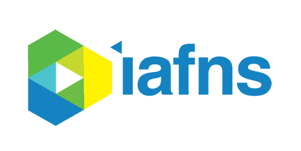

A running list of our public-facing work on **what makes a food "healthy" — and who
gets to decide.** It spans how expert rating systems score carbohydrate foods, how
everyday consumers actually judge them, and the gaps between the two — the educational
and communication priorities that follow. The IAFNS *Carbohydrate Quality* series and
the peer-reviewed papers behind it, all open to watch or read.

```{=html}
<figure class="res-hero-svg">
<svg width="100%" viewBox="0 0 680 340" role="img" xmlns="http://www.w3.org/2000/svg" style="font-family:'Source Sans 3',Segoe UI,sans-serif">
<title>One food, two kinds of disagreement: experts disagree with each other, and consumers misalign with the experts</title>
<desc>A shared healthfulness axis from less to more healthful. The top row shows five expert scores for one carbohydrate food, spread but clustered near a shaded gold vertical band that marks the pooled consensus; the band's width represents the uncertainty that remains. The bottom row shows two consumer personas sitting outside that band on opposite sides, showing that consumers misalign with the expert signal, and not uniformly: one reads the food as less healthful, the other as more healthful than the experts.</desc>

<g class="fi-anim" style="animation-delay:0.1s">
<text x="340" y="32" text-anchor="middle" font-size="15" font-weight="600" fill="#1a3a2a">One food, two kinds of disagreement</text>
</g>

<g class="fi-anim" style="animation-delay:0.4s">
<line x1="80" y1="258" x2="600" y2="258" stroke="#c3bcae" stroke-width="0.75"/>
<line x1="80" y1="258" x2="80" y2="264" stroke="#c3bcae" stroke-width="0.75"/>
<line x1="340" y1="258" x2="340" y2="264" stroke="#c3bcae" stroke-width="0.75"/>
<line x1="600" y1="258" x2="600" y2="264" stroke="#c3bcae" stroke-width="0.75"/>
<text x="80" y="278" font-size="12" fill="#6b7b6b">less healthful</text>
<text x="600" y="278" text-anchor="end" font-size="12" fill="#6b7b6b">more healthful</text>
</g>

<text class="fi-anim" style="animation-delay:0.9s" x="80" y="104" font-size="14" font-weight="600" fill="#1a3a2a">1 · Experts disagree</text>
<circle class="fi-anim" style="animation-delay:1.10s" cx="272" cy="120" r="7" fill="#2a5a3a"/>
<circle class="fi-anim" style="animation-delay:1.22s" cx="330" cy="120" r="7" fill="#2a5a3a"/>
<circle class="fi-anim" style="animation-delay:1.34s" cx="366" cy="120" r="7" fill="#2a5a3a"/>
<circle class="fi-anim" style="animation-delay:1.46s" cx="404" cy="120" r="7" fill="#2a5a3a"/>
<circle class="fi-anim" style="animation-delay:1.58s" cx="440" cy="120" r="7" fill="#2a5a3a"/>

<g class="fi-anim" style="animation-delay:2.1s">
<rect x="319" y="70" width="73" height="188" fill="#b9892a" fill-opacity="0.15"/>
<line x1="319" y1="70" x2="319" y2="258" stroke="#9c7016" stroke-width="0.75" stroke-dasharray="4 3"/>
<line x1="392" y1="70" x2="392" y2="258" stroke="#9c7016" stroke-width="0.75" stroke-dasharray="4 3"/>
<line x1="356" y1="70" x2="356" y2="258" stroke="#9c7016" stroke-width="1.5"/>
<text x="356" y="60" text-anchor="middle" font-size="12" fill="#8a6312">pooled signal + uncertainty</text>
</g>

<text class="fi-anim" style="animation-delay:2.7s" x="80" y="172" font-size="14" font-weight="600" fill="#1a3a2a">2 · Consumer-expert misalignment</text>
<circle class="fi-anim" style="animation-delay:2.95s" cx="215" cy="196" r="8" fill="#6a4ca0"/>
<text class="fi-anim" style="animation-delay:2.95s" x="199" y="200" text-anchor="end" font-size="12" fill="#6a4ca0">carb-cautious</text>
<circle class="fi-anim" style="animation-delay:3.15s" cx="517" cy="196" r="8" fill="#c8651f"/>
<text class="fi-anim" style="animation-delay:3.15s" x="533" y="200" text-anchor="start" font-size="12" fill="#c8651f">health-halo</text>
<line class="fi-anim" style="animation-delay:3.45s" x1="215" y1="196" x2="356" y2="196" stroke="#6a4ca0" stroke-width="3"/>
<line class="fi-anim" style="animation-delay:3.45s" x1="356" y1="196" x2="517" y2="196" stroke="#c8651f" stroke-width="3"/>
<text class="fi-anim" style="animation-delay:3.7s" x="366" y="216" text-anchor="middle" font-size="12" fill="#6b7b6b">heterogeneous, in opposite directions</text>

<g class="fi-anim" style="animation-delay:4.1s">
<circle cx="96" cy="316" r="6" fill="#2a5a3a"/>
<text x="108" y="320" font-size="12" fill="#6b7b6b">expert score</text>
<rect x="208" y="310" width="20" height="12" fill="#b9892a" fill-opacity="0.15" stroke="#9c7016" stroke-width="0.75" stroke-dasharray="3 2"/>
<text x="234" y="320" font-size="12" fill="#6b7b6b">consensus zone</text>
<circle cx="350" cy="316" r="6" fill="#6a4ca0"/>
<circle cx="366" cy="316" r="6" fill="#c8651f"/>
<text x="380" y="320" font-size="12" fill="#6b7b6b">two consumer personas</text>
</g>
</svg>
<figcaption class="fi-anim" style="animation-delay:4.3s">Two kinds of disagreement sit between one carbohydrate food and a clear health message. Five expert systems score it five different ways, then pool into a single signal whose width is the uncertainty that remains. The public then misaligns with that signal, and not uniformly: some read the food as junk, others as a health food. The webinars and papers below work both problems.</figcaption>
</figure>
```

## IAFNS Webinars {#webinars}

The IAFNS Carbohydrates Committee series opens with a consumer-research **lead-in from
NORC** — how everyday Americans judge carbohydrate foods — followed by **three webinars
I presented** on how expert rating systems score the same foods, and where experts and
consumers pull apart.

```{=html}
<div class="res-grid">
  <a class="res-card" href="https://www.youtube.com/watch?v=uEvc8ZRXhNk" target="_blank" rel="noopener">
    <div class="res-thumb"></div>
    <div class="res-body">
      <span class="res-kind">Lead-in &middot; NORC for IAFNS</span>
      <h3>Carbohydrate-Quality Beliefs &amp; Behaviors</h3>
      <p>NORC&rsquo;s consumer research: what everyday Americans believe makes a carbohydrate food healthy &mdash; and why it&rsquo;s so hard to judge.</p>
      <span class="res-link">Watch on YouTube &rarr;</span>
    </div>
  </a>
  <a class="res-card" href="https://www.youtube.com/watch?v=ekCUfds-sWQ" target="_blank" rel="noopener">
    <div class="res-thumb"></div>
    <div class="res-body">
      <span class="res-kind">Webinar &middot; IAFNS &middot; Josh Erndt-Marino</span>
      <h3>A Tool to Compare How Experts Rate Carbohydrate Foods</h3>
      <p>A meta&ndash;nutrient-profiling tool for seeing how different expert systems score the same carbohydrate foods.</p>
      <span class="res-link">Watch on YouTube &rarr;</span>
    </div>
  </a>
  <a class="res-card" href="https://www.youtube.com/watch?v=hjKmtaeRKLc" target="_blank" rel="noopener">
    <div class="res-thumb"></div>
    <div class="res-body">
      <span class="res-kind">Webinar &middot; IAFNS &middot; Josh Erndt-Marino</span>
      <h3>Insights from the Tool Comparing Rating Systems</h3>
      <p>Where expert systems agree, disagree, and leave gaps &mdash; roughly 20% of carbohydrate foods, and half of grains, sit in uncertainty.</p>
      <span class="res-link">Watch on YouTube &rarr;</span>
    </div>
  </a>
  <a class="res-card" href="https://www.youtube.com/watch?v=X2aQIt5O3ZU" target="_blank" rel="noopener">
    <div class="res-thumb"></div>
    <div class="res-body">
      <span class="res-kind">Webinar &middot; IAFNS &middot; Josh Erndt-Marino</span>
      <h3>Alignment Between Experts and Consumers</h3>
      <p>Consumer perceptions set against expert ratings: 85% of foods land an alignment grade of C or D, and four are flagged as priorities.</p>
      <span class="res-link">Watch on YouTube &rarr;</span>
    </div>
  </a>
</div>
```

```{=html}
<div class="res-thanks">With thanks to our collaborators</div>
<div class="res-partners">
  <div class="res-partner">
    <div class="res-partner-logo"></div>
    <p>The Institute for the Advancement of Food and Nutrition Sciences convened the Carbohydrates Committee behind this series.</p>
    <div class="res-partner-links"><a href="https://iafns.org" target="_blank" rel="noopener">iafns.org &rarr;</a><a href="https://www.linkedin.com/company/iafns-science" target="_blank" rel="noopener">LinkedIn &rarr;</a></div>
  </div>
  <div class="res-partner">
    <div class="res-partner-logo"></div>
    <p>NORC at the University of Chicago led the consumer focus-group research that opens the series with the public&rsquo;s own view of carbohydrate healthfulness.</p>
    <div class="res-partner-links"><a href="https://www.norc.org" target="_blank" rel="noopener">norc.org &rarr;</a><a href="https://www.linkedin.com/company/norc" target="_blank" rel="noopener">LinkedIn &rarr;</a></div>
  </div>
</div>
```

## Published Papers {#papers}

```{=html}
<div class="res-grid">
  <a class="res-card" href="https://doi.org/10.1080/09637486.2023.2241672" target="_blank" rel="noopener">
    <div class="res-thumb"></div>
    <div class="res-body">
      <span class="res-kind">Int. J. Food Sci. Nutr. &middot; 2023</span>
      <h3>The integrative food framework</h3>
      <p>A meta-framework that pools six nutrient-profiling systems to find foods that are healthy, impactful, and equitable &mdash; demonstrated on 100% orange juice.</p>
      <span class="res-link">Read the paper &rarr;</span>
    </div>
  </a>
  <a class="res-card" href="https://doi.org/10.1080/27697061.2026.2687436" target="_blank" rel="noopener">
    <div class="res-thumb"></div>
    <div class="res-body">
      <span class="res-kind">J. Am. Nutr. Assoc. &middot; 2026</span>
      <h3>Educational gaps in carbohydrate healthfulness</h3>
      <p>Where public understanding of carbohydrate healthfulness breaks down &mdash; and the communication priorities that follow.</p>
      <span class="res-link">Read the paper &rarr;</span>
    </div>
  </a>
</div>
```
