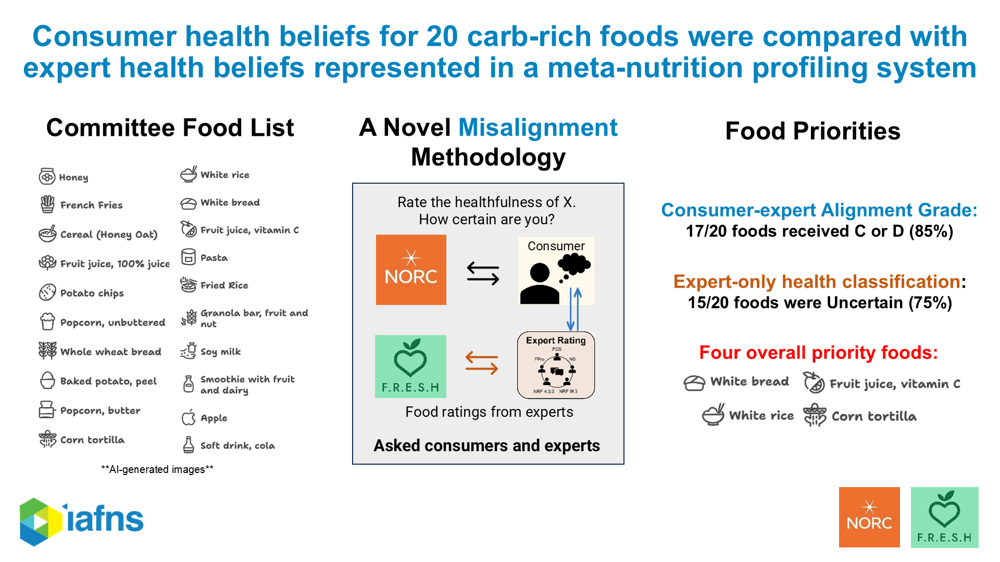
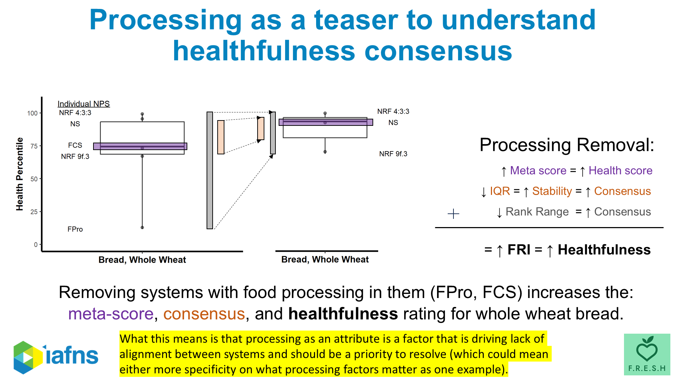

A running list of our public-facing work on **how nutrition decides what counts as
"healthy"** — the IAFNS *Carbohydrate Quality* webinar series, and the peer-reviewed
papers behind it. Everything here is open to watch or read.

{.res-hero fig-alt="Slide reading: The problem — too many health scores. The solution — harmonize them."}

## IAFNS Webinars {#webinars}

A four-part video series from the IAFNS Carbohydrates Committee, presented by Josh
Erndt-Marino, on how consumers *and* expert rating systems judge the healthfulness of
carbohydrate foods — and where the two disagree.

```{=html}
<div class="res-grid">
  <a class="res-card" href="https://www.youtube.com/watch?v=uEvc8ZRXhNk" target="_blank" rel="noopener">
    <div class="res-thumb"></div>
    <div class="res-body">
      <span class="res-kind">Webinar &middot; IAFNS</span>
      <h3>Carbohydrate-Quality Beliefs &amp; Behaviors</h3>
      <p>What U.S. focus groups believe makes a carbohydrate food healthy &mdash; and the trade-offs they weigh when they choose.</p>
      <span class="res-link">Watch on YouTube &rarr;</span>
    </div>
  </a>
  <a class="res-card" href="https://www.youtube.com/watch?v=ekCUfds-sWQ" target="_blank" rel="noopener">
    <div class="res-thumb"></div>
    <div class="res-body">
      <span class="res-kind">Webinar &middot; IAFNS</span>
      <h3>A Tool to Compare How Experts Rate Carbohydrate Foods</h3>
      <p>An expert tool for comparing how different food-rating systems score the same carbohydrate foods.</p>
      <span class="res-link">Watch on YouTube &rarr;</span>
    </div>
  </a>
  <a class="res-card" href="https://www.youtube.com/watch?v=hjKmtaeRKLc" target="_blank" rel="noopener">
    <div class="res-thumb"></div>
    <div class="res-body">
      <span class="res-kind">Webinar &middot; IAFNS</span>
      <h3>Insights from the Tool Comparing Rating Systems</h3>
      <p>How everyday carbohydrate foods get ranked &mdash; and disagreed on &mdash; across expert rating systems.</p>
      <span class="res-link">Watch on YouTube &rarr;</span>
    </div>
  </a>
  <a class="res-card" href="https://www.youtube.com/watch?v=X2aQIt5O3ZU" target="_blank" rel="noopener">
    <div class="res-thumb"></div>
    <div class="res-body">
      <span class="res-kind">Webinar &middot; IAFNS</span>
      <h3>Alignment Between Experts and Consumers</h3>
      <p>Connecting consumer perceptions to expert-system results: where they line up, and where they don't.</p>
      <span class="res-link">Watch on YouTube &rarr;</span>
    </div>
  </a>
</div>
```

## Published Papers {#papers}

```{=html}
<div class="res-grid">
  <a class="res-card" href="https://doi.org/10.1080/09637486.2023.2241672" target="_blank" rel="noopener">
    <div class="res-thumb"></div>
    <div class="res-body">
      <span class="res-kind">Peer-reviewed &middot; Int. J. Food Sci. Nutr. (2023)</span>
      <h3>The integrative food framework</h3>
      <p>A meta-framework that pools six nutrient-profiling systems to find foods that are healthy, impactful, and equitable &mdash; demonstrated on 100% orange juice.</p>
      <span class="res-link">Read the paper &rarr;</span>
    </div>
  </a>
  <a class="res-card" href="https://doi.org/10.1080/27697061.2026.2687436" target="_blank" rel="noopener">
    <div class="res-thumb"></div>
    <div class="res-body">
      <span class="res-kind">Peer-reviewed &middot; J. Am. Nutr. Assoc. (2026)</span>
      <h3>Educational gaps in carbohydrate healthfulness</h3>
      <p>Where public understanding of carbohydrate healthfulness breaks down &mdash; and the communication priorities that follow.</p>
      <span class="res-link">Read the paper &rarr;</span>
    </div>
  </a>
</div>
```
