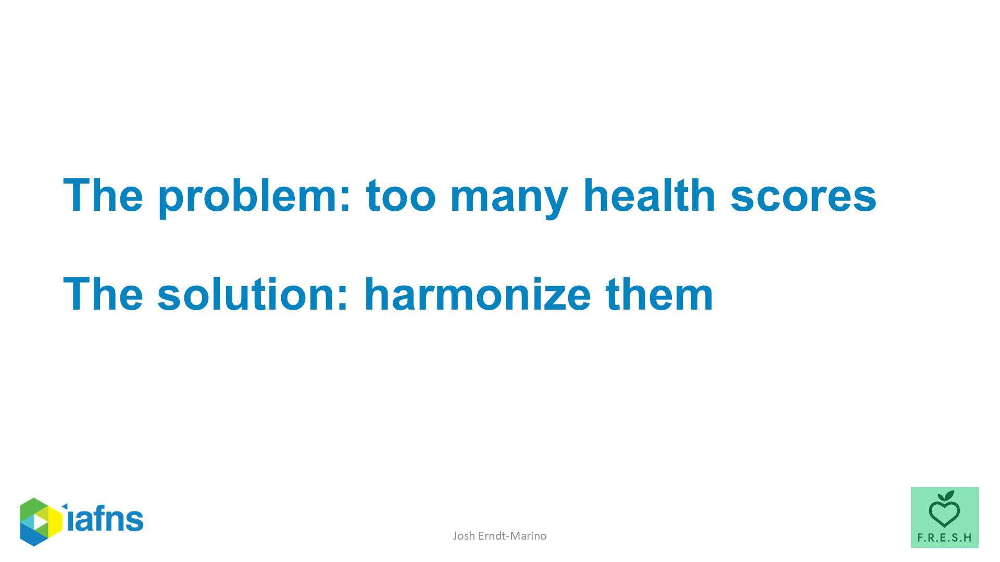
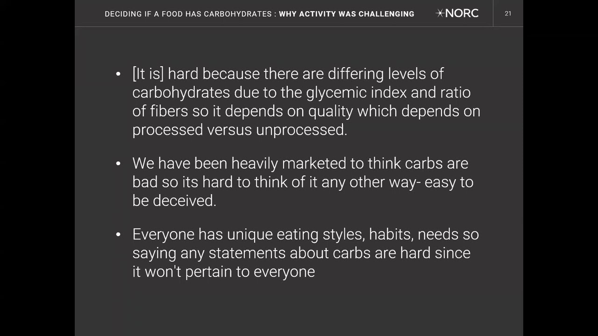
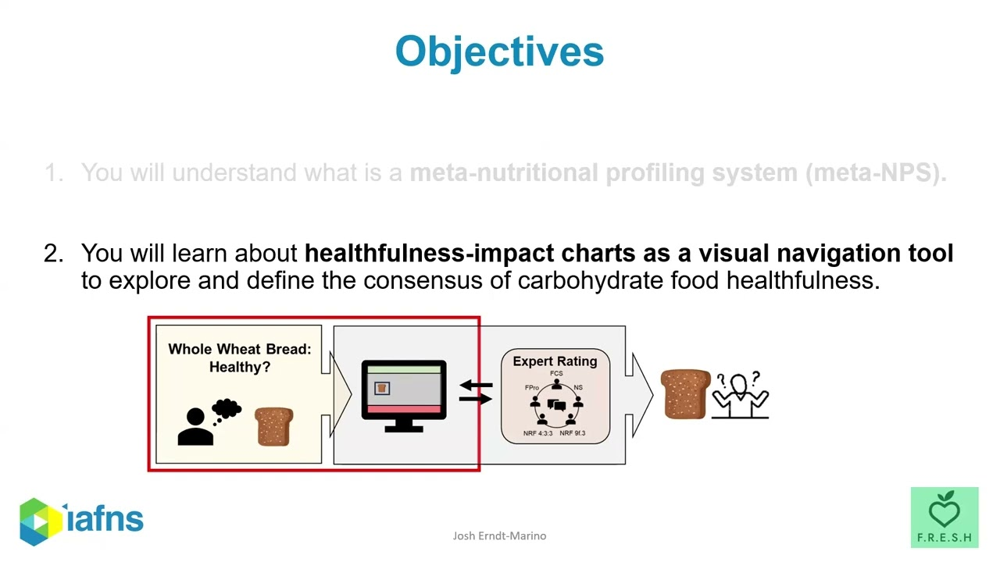
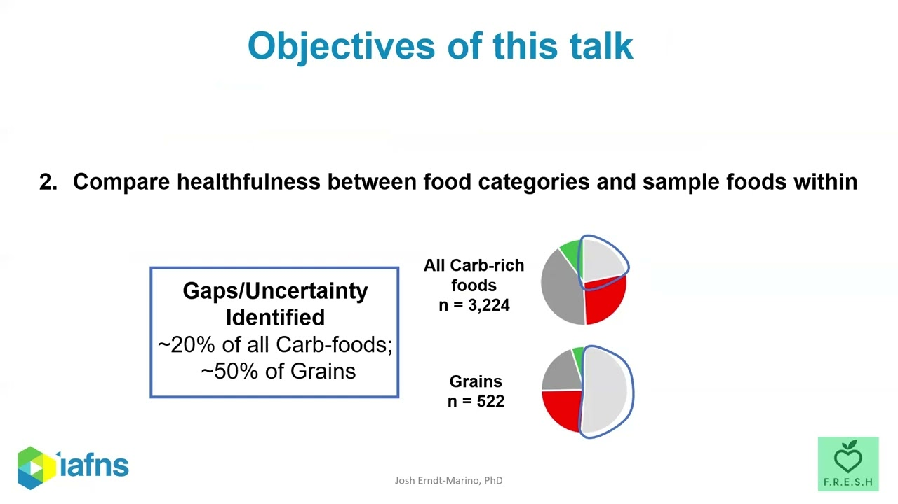
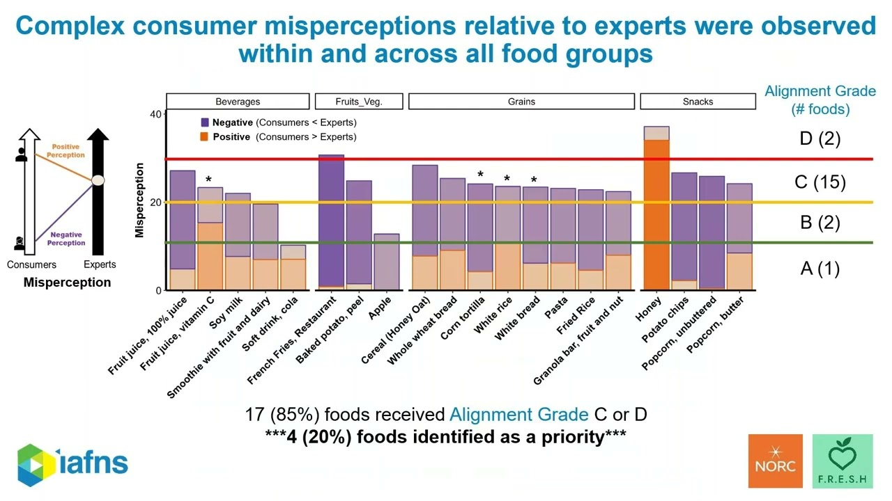
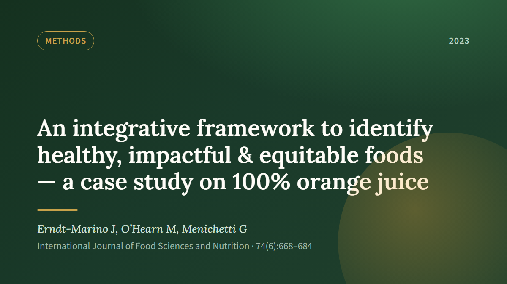
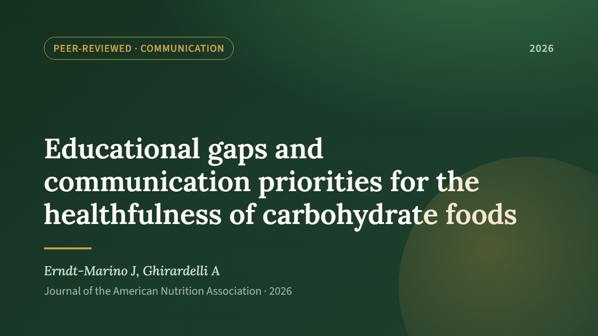

A running list of our public-facing work on **what makes a food "healthy" — and who
gets to decide.** It spans how expert rating systems score carbohydrate foods, how
everyday consumers actually judge them, and the gaps between the two — the educational
and communication priorities that follow. The IAFNS *Carbohydrate Quality* series and
the peer-reviewed papers behind it, all open to watch or read.

{.res-hero fig-alt="Slide reading: The problem — too many health scores. The solution — harmonize them."}

## IAFNS Webinars {#webinars}

The IAFNS Carbohydrates Committee series opens with a consumer-research **lead-in from
NORC** — how everyday Americans judge carbohydrate foods — followed by **three webinars
I presented** on how expert rating systems score the same foods, and where experts and
consumers pull apart.

```{=html}
<div class="res-grid">
  <a class="res-card" href="https://www.youtube.com/watch?v=uEvc8ZRXhNk" target="_blank" rel="noopener">
    <div class="res-thumb"></div>
    <div class="res-body">
      <span class="res-kind">Lead-in &middot; NORC for IAFNS</span>
      <h3>Carbohydrate-Quality Beliefs &amp; Behaviors</h3>
      <p>NORC&rsquo;s consumer research: what everyday Americans believe makes a carbohydrate food healthy &mdash; and why it&rsquo;s so hard to judge.</p>
      <span class="res-link">Watch on YouTube &rarr;</span>
    </div>
  </a>
  <a class="res-card" href="https://www.youtube.com/watch?v=ekCUfds-sWQ" target="_blank" rel="noopener">
    <div class="res-thumb"></div>
    <div class="res-body">
      <span class="res-kind">Webinar &middot; IAFNS &middot; Josh Erndt-Marino</span>
      <h3>A Tool to Compare How Experts Rate Carbohydrate Foods</h3>
      <p>A meta&ndash;nutrient-profiling tool for seeing how different expert systems score the same carbohydrate foods.</p>
      <span class="res-link">Watch on YouTube &rarr;</span>
    </div>
  </a>
  <a class="res-card" href="https://www.youtube.com/watch?v=hjKmtaeRKLc" target="_blank" rel="noopener">
    <div class="res-thumb"></div>
    <div class="res-body">
      <span class="res-kind">Webinar &middot; IAFNS &middot; Josh Erndt-Marino</span>
      <h3>Insights from the Tool Comparing Rating Systems</h3>
      <p>Where expert systems agree, disagree, and leave gaps &mdash; roughly 20% of carbohydrate foods, and half of grains, sit in uncertainty.</p>
      <span class="res-link">Watch on YouTube &rarr;</span>
    </div>
  </a>
  <a class="res-card" href="https://www.youtube.com/watch?v=X2aQIt5O3ZU" target="_blank" rel="noopener">
    <div class="res-thumb"></div>
    <div class="res-body">
      <span class="res-kind">Webinar &middot; IAFNS &middot; Josh Erndt-Marino</span>
      <h3>Alignment Between Experts and Consumers</h3>
      <p>Consumer perceptions set against expert ratings: 85% of foods land an alignment grade of C or D, and four are flagged as priorities.</p>
      <span class="res-link">Watch on YouTube &rarr;</span>
    </div>
  </a>
</div>
```

## Published Papers {#papers}

```{=html}
<div class="res-grid">
  <a class="res-card" href="https://doi.org/10.1080/09637486.2023.2241672" target="_blank" rel="noopener">
    <div class="res-thumb"></div>
    <div class="res-body">
      <span class="res-kind">Peer-reviewed &middot; Int. J. Food Sci. Nutr. (2023)</span>
      <h3>The integrative food framework</h3>
      <p>A meta-framework that pools six nutrient-profiling systems to find foods that are healthy, impactful, and equitable &mdash; demonstrated on 100% orange juice.</p>
      <span class="res-link">Read the paper &rarr;</span>
    </div>
  </a>
  <a class="res-card" href="https://doi.org/10.1080/27697061.2026.2687436" target="_blank" rel="noopener">
    <div class="res-thumb"></div>
    <div class="res-body">
      <span class="res-kind">Peer-reviewed &middot; J. Am. Nutr. Assoc. (2026)</span>
      <h3>Educational gaps in carbohydrate healthfulness</h3>
      <p>Where public understanding of carbohydrate healthfulness breaks down &mdash; and the communication priorities that follow.</p>
      <span class="res-link">Read the paper &rarr;</span>
    </div>
  </a>
</div>
```
