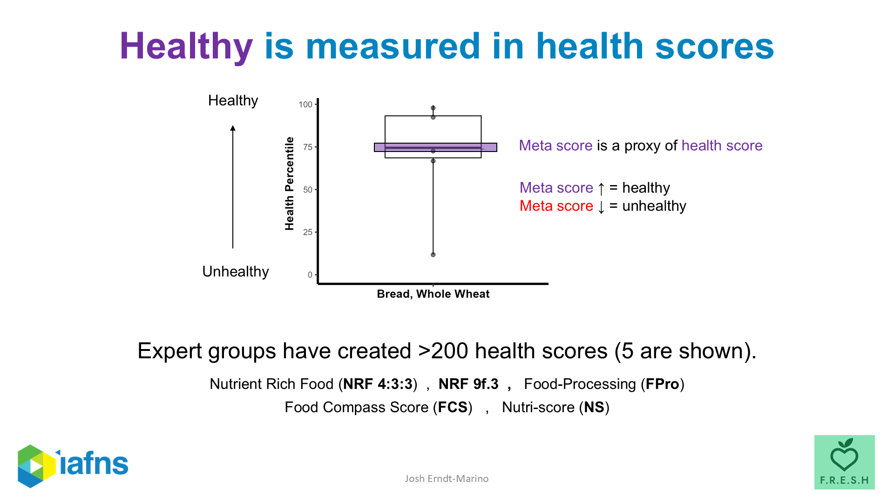
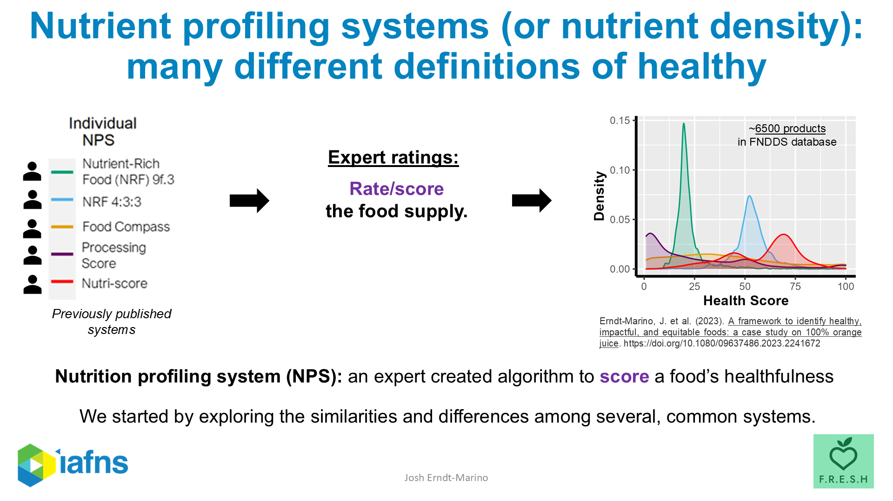

This is one slice of whole wheat bread, scored by five different expert-built food-rating systems.

One system put it near the top of the food supply. Another put it near the bottom. The other three spread out between them.

It is not a stunt. It is not cherry-picked. It is a representative result, from a working analysis I built in collaboration with the Institute for the Advancement of Food and Nutrition Sciences [@erndtmarino2023orange]. And it is the closest thing I can give you to a one-image summary of what is wrong with the way nutrition decides what counts as "healthy."

Because here is what should bother you: there is no fact-of-the-matter that this picture is failing to capture. There is no underlying "true" health-score for whole wheat bread that the five systems are just measuring badly. There are five different operationalizations of the word *healthy*, each built by serious people doing real work, each producing a different number for the same loaf.

And there are about 200 of these systems in the academic literature.[^200nps]

> "It's either unhealthy or very healthy, depending on who you ask."

That is from my own speaker notes, the first time I looked at this slide.

## Fifty years of this

Nutrition has been arguing with itself through expert panels for almost fifty years, and the pattern keeps repeating.

The 1977 McGovern Committee published the first federal *Dietary Goals for the United States*. It was contested on release and was never formally adopted by USDA --- the agency wrote its own *Dietary Guidelines* in 1980 with softer targets. The dietary cholesterol cap that the 1980 guidelines installed stood through nearly every cycle for three decades, then the 2015--2020 edition quietly dropped it, declaring cholesterol "not a nutrient of concern for overconsumption."

The Dietary Guidelines Advisory Committee --- the scientific body that writes the report that feeds the official guidelines --- has been overruled by USDA/HHS in successive cycles. In 2015, the committee's environmental-sustainability recommendation was cut from the final guidelines. In 2020, the committee's proposal to tighten added-sugar limits to 6% of energy was declined; the 10% threshold stayed.

In 2019, the NutriRECS red-meat guidelines were published in *Annals of Internal Medicine* [@johnston2019red]. They diverged sharply from nearly every other major panel. Public letters were written, retraction requests filed. The EAT--Lancet Commission released its planetary-health diet that same year [@willett2019eatlancet] and drew the same kind of rebuttal from the same kinds of stakeholders.

NASEM and the American Heart Association have published different population sodium targets for years and show no sign of converging.

This is not a list of accidents. This is the steady state of nutrition guidance.

## The current cluster on "what is healthy"

In the last 18 months alone, on the single question of what counts as a "healthy" food:

- **FDA** finalized its updated "healthy" claim rule [@fda2024healthy] --- nutrient-and-food-group based, indifferent to processing
- The **2025--2030 Dietary Guidelines** told Americans to limit "highly processed" foods without defining the term [@dga20252030]
- The **Healthy Eating Research** expert panel released a NOVA-aligned UPF definition that captures roughly 71% of US foods [@her2025upf]
- The **WHO** convened its own Guideline Development Group for ultra-processed foods [@who2024upf]
- The **Institute of Food Technologists** keeps publicly calling for a more rigorous classification

A fortified whole-grain cereal can qualify as FDA "healthy" *and* be category-4 ultra-processed under HER's definition. The same product, opposite verdicts, depending on which expert body you ask.

And every one of those panels is doing serious work. None of them are wrong on their own terms. They are just answering different questions with different methods and arriving --- predictably --- at different conclusions. The system is functioning exactly as designed. The system is the problem.

## What the panels are sampling from

Here is what the panels are actually working from.

There are more than 200 distinct nutrient-profiling systems in the literature, plus a long tail of commercial systems (Nutri-Score, NuVal, Guiding Stars, Health Star Rating, the Nutrient Rich Foods family, the Food Compass score, dozens of proprietary brand-level systems).[^nps-survey] Hundreds of thousands of nutrition papers in PubMed, growing daily. Any single expert panel reviews a sliver of this --- narrowed by scope, by deadline, by committee composition, by what's politically tractable to recommend.

The output of any one panel is a compressed synthesis of a compressed synthesis. A different panel uses a different sliver, reaches a different conclusion, and we relitigate.

I ran the comparison across five systems on about 6,500 foods. The distribution above is what came out. As I said in the webinar where I first presented this:

> I remember just staring at the screen for a while when I first saw this image. The food supply doesn't have a "healthiness" shape. It has five different ones, depending on which expert you trust.

## It gets worse --- the data the panels review is itself undersampled

The current administration is loudly calling for gold-standard science on food additives. That is the right ask. But here is what gold-standard science would actually need, and what's actually available.

National food databases catalog roughly 8,000 foods. The branded US food supply has more than 300,000. Nutrition Facts panels measure approximately 10 nutrients per food, seldom checked for accuracy. There is no comprehensive, public, product-level database of additive concentrations linked to who eats which products and how much.

The NutriNet-Santé cohort keeps publishing emulsifier-and-health papers from participants who reported their diets through 24-hour recalls --- without knowing how much of the additives those participants actually consumed, because the actual additive concentrations in the products they reported eating aren't reliably measured anywhere.[^nutrinet]

Gold-standard science requires data. On large stretches of the food supply, we have black holes.

## And this is where the misinformation crisis lives

The World Economic Forum and the United Nations both rank misinformation as a top-tier global risk [@ratzan2026qhi]. Generative AI amplifies it. Trust in public health agencies has eroded.

But notice what creates the operating environment for that crisis: it is not malice. It is not even mostly stupidity. It is the structural condition we have just laid out --- panels that visibly disagree, an underlying evidence base too undersampled to settle the disagreements, no shared method for showing the public how settled or contested any given claim actually is.

When "the experts disagree" is *genuinely true* --- and on UPF, on sodium, on red meat, on saturated fat, on most of nutrition's high-stakes questions, it really is true --- anyone can claim expert cover for almost anything. Bad-faith actors thrive in this. Well-meaning influencers thrive in this. AI-generated wellness content thrives in this. The public has no infrastructure for separating real epistemic uncertainty from manufactured controversy from noise.

## What the meta-expert-panel idea actually is

Here is the move I want to argue for.

When five expert systems give you different scores for whole wheat bread, you can do one of two things. You can pick a system (or invent a sixth) and declare it the right one. Or you can treat the disagreement itself as the information.

> Each expert-built rating system is, formally, an expression of expert belief. A formalized, transparent, reproducible expression of what one group of experts thinks "healthy" means in operational form. That is what an algorithm *is.*

If you treat panel outputs that way --- as belief expressions you can analyze, not verdicts you have to choose between --- then disagreement is not a failure mode. It is a signal. It tells you where the field is settled and where it is not, where consensus would actually emerge if you forced the question, and where honesty with the public means admitting the science has not landed.

This is what a **meta-expert panel** is: work that treats panel outputs as data, maps convergence and dissensus, makes the disagreements navigable, and quantifies how settled the underlying science actually is.

It is necessary, but it is not sufficient on its own. Two reasons. First, the evidence base has grown faster than any committee-based process can credibly metabolize --- even meta-synthesis at the panel level only goes so far when the panels themselves saw only 1% of the relevant literature. Second, parts of the evidence base were never built in the first place; you cannot synthesize across data that nobody collected.

But it is the right *kind* of move. And it is what I have been building.

::: {.content-visible when-format="html"}
::: {.callout-note appearance="simple"}
## A note on what "meta" means here

I am not arguing for one more authoritative meta-panel to overrule the others. I am arguing for a methodological commitment: treat the existing panels as data sources, the same way a meta-analysis treats individual studies. Both consensus *and* disagreement become quantifiable, navigable, and reportable to the public with appropriate confidence.
:::
:::

## The work, in three pieces

Three pieces of methodology, under one umbrella I have been building toward with FRESH:

**Meta-NPS** --- the food-rating-systems-as-data approach. Take five (or fifty) expert rating systems, harmonize them statistically, and produce: a meta-score, a stability measure, and an aggregate index that captures both. The output tells you *and quantifies* where systems converge ("certainly healthy" foods that every system agrees on), where they diverge ("uncertain" foods where the experts cannot agree), and where consumer beliefs misalign with the expert consensus.

I have run exactly this analysis across the US carb-rich food supply, and the "uncertain" zone is not small. Of roughly 3,200 carb-rich foods, the uncertain zone claims about 20%. For grains specifically, the number is ~50%. Half of all grain-based foods are foods on which the experts cannot agree.

**FRESH Epi** --- an AI tool that takes a nutrition epidemiology paper and separates what it found, what we can reasonably conclude, what we cannot, and a plain-language summary you can share without hype. If the meta-NPS treats panels as data, FRESH Epi treats individual papers the same way --- pulling apart the design from the takeaway, surfacing where the published narrative outran what the study could actually show. It has been catching things even careful scientists summarize too confidently.

**The integrative analytical framework** --- worked out as a case study on 100% orange juice [@erndtmarino2023orange], but the methodology generalizes. The two-part approach (meta-NPS for healthfulness + multilevel regression with poststratification for population-level impact and equity) is what lets you ask "is this food healthy *and* impactful *and* equitable to recommend" without pretending the underlying disagreements are not there.

Some of this work has been done as IAFNS-adjacent methodological collaboration. All of it sits under the same conceptual roof: **treat expert and consumer beliefs as data we can synthesize, quantify, and present honestly.** That is the umbrella.

## The processing example, because someone will ask

If you want a concrete example of what "treating disagreement as information" actually buys you, this is it.

For whole wheat bread, the five-system disagreement we opened with is not random. When you remove the two systems that include processing-related variables, the remaining three converge. The variable driving expert disagreement on this food is "processing." Take it out of the algorithms and consensus emerges. Leave it in and the panels fight forever.

That is not an answer to the FDA-vs-HER tension. But it is a clean diagnosis of where the tension lives. And it tells you exactly what NPS designers would need to agree on (or transparently disagree about) to stop producing this particular disagreement.

## What good would look like

The useful questions are not *which panel wins.* They are:

- What does consensus actually look like across panels?
- Where are the real fault lines, and what is driving them?
- Where are the data we do not even have?
- And how do we give the public an honest, navigable map of what we actually know?

In my talk to the IAFNS Carbohydrate Committee, the last working slide had three concrete asks. They still hold:

> NPS creators should come together to resolve disagreements with a transparent process.
>
> Communication strategies aiming to aid consumer decision making should leverage expert-consumer alignment to evaluate overall campaign efficacy.
>
> Bidirectional education and more research to elicit our beliefs and create a more shared understanding of where they come from.

## Information can be health

The deeper conviction underneath all of this work is simple, and I keep returning to it: **information can be health.**

Not "more information." Not "the right information," handed down by the right panel. Honest information --- including honest uncertainty. The willingness to tell a person *this food is healthy under three of the five expert systems we trust, and we do not yet know which three are right* instead of pretending there is a single answer because giving one feels more reassuring.

Information can be health. We have to get serious about building it.

---

**If you want to go deeper, my prior thinking on each piece of this argument:**

- The 200-NPS scale problem, via Nutri-Score: <https://www.linkedin.com/feed/update/urn:li:activity:7241506136305147904/>
- Meta-NPS as consensus-building methodology: <https://www.linkedin.com/feed/update/urn:li:activity:7336396203124744195/>
- Education without consensus: <https://www.linkedin.com/feed/update/urn:li:activity:7366619796857180162/>
- FRESH Epi introduction: <https://www.linkedin.com/feed/update/urn:li:activity:7432851594896994304/>
- FRESH Epi in action: <https://www.linkedin.com/feed/update/urn:li:activity:7433244788516167680/>
- The whole thesis in one paragraph (2025): <https://www.linkedin.com/feed/update/urn:li:activity:7333176632716800000/>
- Misinformation as a top-tier global health risk: <https://www.linkedin.com/feed/update/urn:li:activity:7445590207317340161/>
- The Ferris Wheel --- 8,000 foods vs. 300,000+ branded products: <https://www.linkedin.com/feed/update/urn:li:activity:7239641678980993024/>
- "Yes. Information can be health. Now let's get building.": <https://www.linkedin.com/feed/update/urn:li:activity:7445816974464520192/>

[^200nps]: The "200+ NPS" figure draws on the broad literature on nutrient-profiling systems, plus the commercial/proprietary ecosystem.

[^nps-survey]: Labonté and colleagues have catalogued the academic NPS landscape; commercial systems push the count significantly higher.

[^nutrinet]: NutriNet-Santé is a 170,000+ participant French cohort that has produced many high-profile emulsifier and UPF health papers. The point is not that the research is worthless --- it is that the underlying additive exposure data is structurally incomplete in ways the published abstracts rarely make clear.
