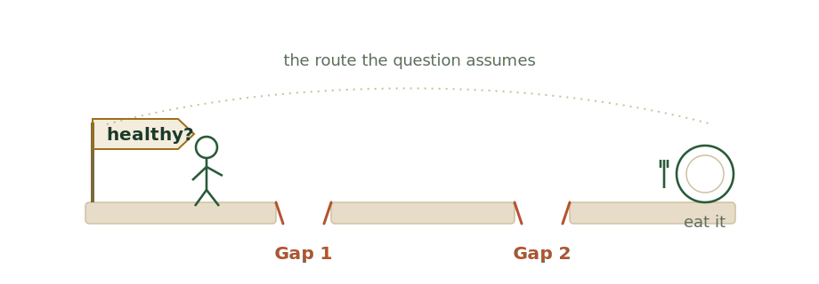

It is one of the most common questions in nutrition, and it makes for a good
talk title: **if we know what's healthy, why don't we eat it?** The question
feels obvious. It also smuggles in two assumptions. First, that *we know* what's
healthy. Second, that the gap between knowing and eating is a gap of will, with
cost as the runner-up excuse.

{.two-gaps-scene fig-alt="A path from a 'healthy?' signpost toward a plate, broken by two labelled gaps, with a figure stopped at the first."}

Two lines of our work break those assumptions, one each. Put them together and
the single gap in the question turns into two, and neither one is willpower.

```{=html}
<iframe class="story-frame" id="keFrame" src="knowing-eating.html?v=3" title="Interactive: the path from knowing what's healthy to eating it, with two leaks — a knowing gap (experts disagree, the public misperceives) and a doing gap (fruit adherence collapses with age, not income)" style="width:100%;border:1px solid #eee8df;border-radius:12px;background:#fffdf8;height:560px" scrolling="no"></iframe>
```

## The first gap: we don't share a definition of "healthy"

Start with the word *know*. It implies a settled answer that everyone can be
handed. For carbohydrate foods, the staple aisle of the diet, that answer does
not exist yet.

Run five expert rating systems across twenty common carb foods and they return
the same verdict, *uncertain*, on fifteen of them. The experts who build these
systems disagree with each other on three of every four foods. There is no
single signal waiting to be transmitted.

That is only the experts. Bring in the public and a second layer opens. Set roughly 450 consumers' beliefs
against the pooled expert rating and seventeen of the twenty land far off — a C or
D on a grade that scores the *size* of the consumer–expert gap. The miss also has
a direction: most foods pull both ways at once, but the
net read is pessimistic, scoring carb foods *less* healthy than even the experts
do (only a few, like honey or a sugary “vitamin C” drink, read as clearly
healthier). This is not random ignorance. It is a structured, food-by-food set of
beliefs that happens to be wrong in a consistent way.

So before anyone weighs willpower, the premise is already strained. We do not
have one shared definition of healthy to act on. We have a contested expert
signal and a public that misreads it in a predictable direction. The full
walk-through, food by food, is in
[The Carb Education Gap](../the-carb-education-gap/).

## The second gap: where eating collapses, it isn't price

Now grant the premise anyway. Take a food no one argues about, where healthy is
genuinely settled: whole fruit. Does knowing translate into eating?

It collapses with age. Among U.S. toddlers, about 61% meet the fruit
recommendation. By the late teens it is 6%. That is a 55-point cliff, and the
single national figure everyone cites (“about 23% of children”) averages it
away entirely.

But the reflex is to call it cost. The reflex is wrong here. The income gap runs
from 18% to 25%, seven points against the cliff's fifty-five, about twelve cents
on the dollar of the age effect. And cost cannot explain who is winning: the
highest-adherence children in the country are Mexican-American kids at 31%, ahead
of higher-income non-Hispanic White kids at 18%. One cost variable cannot move
in both directions at once. USDA's own consumption report agrees from the other
side: household income and fruit prices carry *less* weight than behaviors that
signal health concern and nutrition knowledge.

So the second gap is real, but it does not sit where the question assumes. It is
not price, and it is not a simple shortage of willpower. It tracks the
environment a teenager moves into (who controls the plate, what is stocked, what
a snack signals to friends) and the concern and knowledge they bring to it. The
full argument, including why “age” is a container and not a cause, is in
[If It's Not the Price of Fruit, What Is It?](../not-the-price-of-fruit/).

One honesty note carries over from that piece: this is where the gap lives, not
a finished account of why. Fruit intake actually recovers later in life, which
rules out any tidy “autonomy and the market” story as the whole explanation.

## Two gaps, one neglected place

Line the two up and they point at the same blind spot. The first gap sits in
whether we even agree on what healthy means and whether we communicate it
clearly. The second sits in the environment that surrounds the eater, plus the
health concern and know-how they bring there. Both are features of the
**informational and food environments**, the parts of the system we measure
least and fund last.

Because we fund them last, what we reach for instead are the two loudest dials:
willpower and price. Tell
people to try harder, or make the healthy thing cheaper. Both matter at the
margin. Neither is where this gap is largest. We keep tuning the small dials
because they are the ones in plain sight, and stepping over a contested
definition and a 55-point collapse to do it.

So the honest version of the talk's question is not a single *why*. It is two.
Do we actually agree on what healthy is, and have we said it clearly? And does
the world around the eater make the healthy choice the available one? Answer
those and the willpower question mostly takes care of itself.

> **One question, two gaps underneath it, and willpower is neither of them.**

*Drawing on the FRESH meta-NPS and dietary-surveillance pipelines. The carb
figures are a conservative floor (five of many rating systems); the fruit cliff
is one pre-pandemic survey, NHANES 2017–18.*

```{=html}
<script>
(function(){
  var frames=document.querySelectorAll("iframe.story-frame");
  function fit(f){ try{ var d=f.contentDocument; if(d&&d.body){ f.style.height=(d.body.scrollHeight+8)+"px"; } }catch(e){} }
  function sendVp(f){ try{ f.contentWindow.postMessage({kind:"vph",h:window.innerHeight},"*"); }catch(e){} }
  frames.forEach(function(f){
    f.addEventListener("load",function(){ sendVp(f); fit(f); setTimeout(function(){ sendVp(f); fit(f); },400); });
  });
  window.addEventListener("resize",function(){ frames.forEach(function(f){ sendVp(f); fit(f); }); });
  window.addEventListener("message",function(e){ if(e&&e.data==="story-fit"){ frames.forEach(fit); } });
  if("IntersectionObserver" in window){
    var io=new IntersectionObserver(function(es){
      es.forEach(function(en){ if(en.isIntersecting){ try{ en.target.contentWindow.postMessage("play-story","*"); }catch(e){} } });
    }, {threshold:0.25});
    frames.forEach(function(f){ io.observe(f); });
  }
})();
</script>
```
