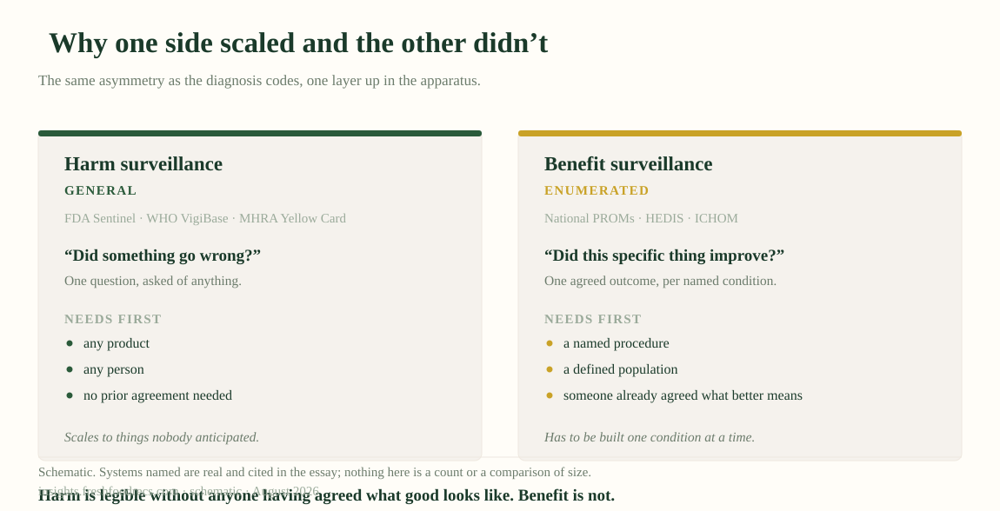
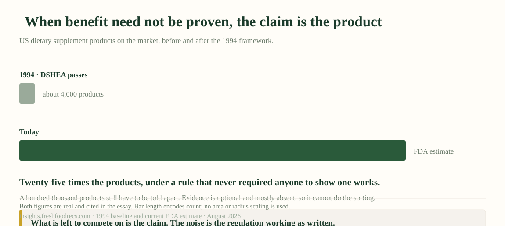

::: {.fi-tldr}
**The short version.** *Every line links to its source. A summary that strips provenance is doing the thing this piece argues against.*

- **One alarm got built, and it detects damage.** [Sentinel](https://www.sentinelinitiative.org/) follows roughly 138.7 million people; [VigiBase](https://who-umc.org/vigibase/) pools case reports from well over a hundred countries. Both ask of any product in anyone: did something go wrong? Berberine is inside that net.
- **The alarm for the other pole barely exists.** Saying a treatment has quit working needs a marker that prior trials tied to the outcome, so it needs a diagnosis and a known pathway. [Contrave's label](https://www.accessdata.fda.gov/drugsatfda_docs/label/2014/200063s000lbl.pdf) has one: discontinue at week twelve below 5% weight loss. Berberine, sold that month for that goal, has nothing.
- **Where no marker exists, nobody had to prove anything either.** Supplements are [policed for harm after sale](https://ods.od.nih.gov/factsheets/DietarySupplements-Consumer/), the product count went from 4,000 in 1994 to more than 100,000, and with evidence optional brand does the sorting.
- **The missing object is already deployed for one disease.** An asthma action plan hands a patient a number, a zone and an instruction, fired by a reading rather than a calendar, because peak flow is cheap and sits on the causal path.
- **People read that environment about as well as it deserves.** [In our data](https://doi.org/10.1080/27697061.2026.2687436), 17 of 20 carbohydrate foods sit far from expert consensus and 70% are misread in both directions at once, the signature of noise rather than of ignorance.

**So one question sorts the serious from the rest:** what would a company have to see before it told a customer to walk away?
:::

There is a weight-loss drug whose label tells the prescriber when to give up on
it.

That drug is Contrave. Section 2.1: evaluate response after twelve weeks at the
maintenance dose, and *"if a patient has not lost at least 5% of baseline body
weight, discontinue CONTRAVE, as it is unlikely that the patient will achieve and
sustain clinically meaningful weight loss with continued treatment."*

Read that twice, because it is rare. It names a number, a date and a consequence,
and it fixes all three **before** anybody starts. A regulator wrote a
falsification condition into a package insert.

Now set berberine beside it, a supplement marketed for two years as "nature's
Ozempic." Same goal, frequently the same person, in the same month, choosing
between the two. No sentence like that appears anywhere on it, and more to the
point, nothing in the apparatus would ever produce one.

That absence is where Part 1 leads. It counted [74,719 codes in
ICD-10-CM](../the-health-gap/) for what is wrong with you against no agreed
metric for whether you are healthy, and called the difference the health gap.
This essay follows it downstream, to the moment somebody has to decide whether to
keep doing the thing they started.

I spent a month mapping the organizations sitting between published evidence and
somebody acting on it, looking for who says stop. What I found was not an
absence. It was a boundary, and medicine is almost the only thing inside it.

## Where stopping rules already exist

Inside that boundary, stopping rules are ordinary. Rheumatoid arthritis has a
validated disease activity score, so [treat-to-target](https://ard.bmj.com/content/75/1/3)
fixes a target, a review interval and an escalation rule, and it is the
international standard of care. Oncology has
[RECIST](https://pubmed.ncbi.nlm.nih.gov/19097774/), so *progressive disease* is
defined before anything begins and the criteria that started a treatment can end
it. Critical care has the [time-limited trial](https://www.atsjournals.org/doi/10.1513/AnnalsATS.202310-925ST),
a formal published definition with sixteen essential elements, including
measurable markers of improvement, measurable markers of deterioration and a
reassessment date, agreed with the family before the therapy begins. Contrave's
label does that job for an ordinary outpatient prescription.

So the machinery is real, mature, and in places mandatory. Any version of this
argument that opens with *nobody has thought about when to stop* is wrong, and a
reader who works in rheumatology or intensive care would put it down at that
sentence. Medicine belongs here as the comparison class rather than as the
subject. It is the one place a stopping rule reliably exists, which is what
proves the instrument can be built at all. Everything after this is about the
territory outside it.

## The boundary

That territory begins wherever one requirement fails, and every example above
needed the same one: **a validated surrogate sitting on the causal path of a
diagnosed condition.** A disease activity score. A tumour measurement. A body
weight percentage that predicts sustained loss.

The requirement does enormous work. It needs a *diagnosis*, which rules out
everyone below the threshold. It needs a *causal path*, which rules out anything
whose mechanism is diffuse or contested. And it needs somebody to have
*validated* the measure already.

Validated is the load-bearing word, and it is not a matter of anyone agreeing the
marker sounds right. Naming the outcome you care about is step one, and it is the
easy one. The claim underneath is evidentiary and causal: prior trials
established that a treatment's effect on the marker carried through to that
outcome. A marker that merely tracks the outcome fails this, and fails it
expensively, because the drug moves the marker on schedule while the thing you
cared about does not follow.

That third condition is the binding one. The FDA publishes a table of surrogate
endpoints it has accepted as the basis of approval; it runs past two hundred
entries, was compiled retrospectively as far back as the agency's databases and
institutional memory reach, and has been updated every six months since
2018.[^biomarker] Every entry got there because somebody wanted an approval for
one named indication.

Congress also built a general route, meant for everybody that approval route
leaves out. The Biomarker Qualification Program is where a measure becomes usable
by anyone, rather than accepted once inside a single company's application.
Ninety-nine projects have entered it and sixty-one were accepted. Eight
biomarkers have been qualified, every one of them under the process that preceded
the current one. Of the five projects that ever proposed a surrogate endpoint,
four filed a qualification plan and none has been qualified, and the plans alone
took a median of 3.9 years to write.[^biomarker]

None of that reflects benefit turning out to be unmeasurable. The program was
never tied to user fees, has no dedicated funding or staff, and takes a median
six months for a first review against its own three-month target. Qualifying a
measure for general use is also a public good that helps your competitors, while
getting the same endpoint accepted inside your own approval is faster and stays
yours. So the pipeline is not closed. It runs one way, and the route built for
everyone else was left running on nothing, which is worse than closed, because
closed would at least have been a decision. The three conditions are easier to
see applied to cases than described in the abstract.

{fig-alt="A table of seven cases against three conditions: a diagnosis, a dominant causal pathway, a validated surrogate, bracketed as all three of the same person, treatment and outcome. Contrave, treat-to-target, RECIST and the time-limited trial fill all three cells with a concrete entry and answer yes to can anything say stop. Berberine, a life-extending diet for healthspan, and you most of the time leave all three blank and answer no. Below: one blank cell is enough, there is no partial credit in this table."}

Watch a new candidate try to fill those cells. **Compression of morbidity**, the
idea that a good intervention should shorten the sick part at the end of life
rather than only extend the whole of it, is the closest anyone has come to naming
a positive-pole outcome you could measure, and it is what the longevity field is
implicitly selling. Thapa and colleagues went looking for that compression in
mice on life-extending diets, with survival and vitality tracked to the end. The
interventions extended life. They **did not compress morbidity**.[^com]

That failure is subtler than a surrogate going wrong. **Lifespan was never
qualified as a stand-in for healthspan**, and no qualified surrogate for
healthspan exists at all, which is the whole problem. Lifespan is the quantity
that can be counted, so it is what gets counted, and the field reports it while
talking about healthspan on the assumption that the two travel together. The mice
tested that assumption, and anyone reading the survival curve alone would have
been confident they were winning.

{fig-alt="Three horizontal bars compare a baseline lifespan with two possible outcomes. Baseline: a healthy span then a sick span. Compression: longer life, shorter sick span. Observed: longer life, with the sick span the same or longer. A dashed box reads: lifespan is not a validated stand-in for healthspan."}

So saying *stop* turns out to be close to coextensive with holding a validated
surrogate, and validated surrogates cluster tightly around diagnosed conditions
with a dominant pathway. That covers a great deal of medicine. It covers almost
none of health.

The person this essay is about falls outside all three conditions at once. Below
the diagnostic threshold. Taking something that never sat on an approval pathway.
Pursuing more energy, better sleep, aging well, for which no biomarker was ever
qualified and, at the current rate, none ever will be. So *is this working?* has
no instrument behind it. The instrument did not break. Nobody built one for that
question.

## One alarm, pointed at everything

Nobody built it there, and the contrast gets sharper one layer up, in
surveillance. The FDA's Sentinel network has roughly **138.7 million members
currently accruing data**. The World Health Organization's VigiBase pools tens of
millions of individual case safety reports from well over a hundred countries.
Both put a single question to any product, in anyone: did something go wrong?
Berberine sits inside that net. So does every supplement on the shelf, every
drug, and everything you took last week.

That question can be put without knowing in advance what you were hoping for,
which is why it generalises. Benefit surveillance is not absent, and it would be
easy to write as though it were.[^benefit] England's National PROMs Programme
collects before-and-after patient-reported outcomes on NHS-funded joint
replacement at national scale. HEDIS reports benefit measures across US managed
care. ICHOM publishes standard outcome sets by condition.

But look at what each one needed before it could start. A named procedure or a
named condition. A defined population already inside the system. And an outcome
somebody had to specify in advance, one named condition at a time. **Harm
surveillance is general; benefit surveillance is enumerated**, and the
enumerating has to be done by somebody who already decided what counts as better,
which is exactly what Part 1 said we have no general answer to.

Which gives this essay its title. The alarm we built rings when a product damages
you, and we pointed it at the whole market, supplements included. The alarm for
benefit would ring when a thing you are doing has stopped being worth doing, and
its absence is close to total: nothing for supplements, wellness or longevity,
and nothing for most of medicine either, outside that narrow boundary.

{fig-alt="Two panels contrast harm surveillance with benefit surveillance. Left, harm surveillance, labelled general: one question asked of any product in any person, needing no prior agreement. Right, benefit surveillance, labelled enumerated: one agreed outcome per named condition, needing a named procedure, a defined population, and someone who already agreed what better means."}

## The burden of proof inverts

That asymmetry is not an accident of what was easy to build. It is written into
the law, and the clearest statement of it comes from the National Institutes of
Health.

> "Unlike drug products, there are no provisions in the law for FDA to approve
> dietary supplements for safety or effectiveness before they reach the
> consumer. Once a dietary supplement is marketed, FDA has to prove that the
> product is not safe in order to restrict its use or remove it from the
> market."[^ods]

For a new prescription drug, the manufacturer must demonstrate **benefit** before
anyone can sell it. For a supplement, nobody demonstrates benefit at all, and the
regulator must demonstrate **harm** afterwards. On one side of that line somebody
has to prove the positive pole. On the other, the only question anyone is ever
obliged to answer is whether it hurt you.

So for the products people take on their own initiative, in the categories where
"should I still be doing this?" is the live question, **there was never a benefit
claim on record to revise against.** You cannot detect that something stopped
working if nothing ever established that it worked. Newer categories sit in
stranger territory still, since compounded peptides and research chemicals move
through channels where neither the drug bar nor the supplement framework applies
cleanly. I will not characterise that position precisely, because I have not
verified it to the standard this essay demands of everyone else, but the
direction is not in doubt: the further a product sits from the approval pathway,
the less anyone ever had to show it does anything. Someone choosing between a
prescription, a supplement and a peptide is choosing between three different
evidence regimes, and nothing in the purchase tells them which one they are in.

### What the inversion produces

The clearest evidence of what the inversion produces is a count. When DSHEA
passed in 1994 there were about **4,000** dietary supplement products on the US
market. The FDA now estimates **more than 100,000**, and the NIH's label database
catalogues over 125,000.[^noise] The FDA calls that expansion roughly twentyfold;
its own current estimate puts the ratio closer to twenty-five. Take either
figure, and it happened where no one, at any point, has to demonstrate that
anything works.

Now ask the obvious commercial question. A hundred thousand products have to be
told apart somehow, most of them are the same handful of compounds, and evidence
cannot do the sorting because it is optional and mostly missing. What is left is
**brand and claim**, and for supplements it is mostly brand. The molecule is a
commodity; the packaging, the founder and the person telling you it changed their
life are the product.

So the influencers are not a corruption of the system. They are the system
working as designed, and getting here needs no bad actors, only a rule that makes
evidence optional and a market large enough to fill the space.

{fig-alt="Two bars compare the size of the US supplement market before and after 1994. In 1994, when DSHEA passed: about 4,000 products, a short bar. Today: more than 100,000 by FDA estimate, a bar twenty-five times longer, the ratio of the two counts. Below: what is left to compete on is brand."}

Notice where a market like that leaves the person inside it. Our own map of who
is building at each step of a consumer health decision is thinnest exactly where
the claim arrives: the unbidden encounter, the feed, the shelf, the
recommendation nobody asked for. Nearly everyone is building for someone who
already has a question and is already looking. The moment the belief forms is
owned by parties with no obligation to be right.[^encounter]

Which is why I have stopped describing any of this as a public understanding
problem. If the only signal reaching you is a claim, and no claim ever had to be
earned, then being confused is not a failure of literacy. **I would be confused
too.**

## What this costs the person

Two layers, one shape: damage instrumented in general, benefit only where
somebody enumerated it, and a market that never had to enumerate anything at all.
Follow both down to a person and the last step is the one that breaks. Somebody
has to find out the thing is not working, and stop.

Almost nothing between evidence and action is built for that step. Be careful
where that observation comes from: the stage definitions I used to sort those
organizations only got written [inclusion
tests](../ai-for-science-map/method.html) after the current release shipped, and
the map is still behind them.[^provenance] So take the smaller and checkable
version of the claim.

**Of the organizations in this survey, one produces a decision artifact you could
re-read a year later.**

That one is MDCalc, and it shows the standard is reachable. Its calculators ship
with the derivation study and the validation lineage, and many carry commentary
from the people who built the score. It hosts the PREVENT equations, which
replaced the Pooled Cohort Equations that had governed statin decisions for a
decade, and the first line of its Pearls and Pitfalls says the tool "updates and
replaces the AHA/ACC Pooled Cohort Equations published in 2014."[^prevent] So
that artifact carries its derivation *and* its revision history. What it does not
carry, and what nothing carries, is the consequence. That is Part 3: when one
equation replaces another, it moves who gets treated.

Nothing carries that consequence, and the shape of what surrounds the decision is
part of the reason. Primary care practices, supplement brands, wearable
companies, subscription apps. Every one is built to start you on something and to
sustain you on it. None is built to stop you, since stopping needs a measure most
of them do not have, and a subscription that ends is a subscription that ends.

That list includes me, so I should be straight about my own position. Five
engines sit behind what I build here. They read the literature end to end and
keep a trail from every claim back to its source, they measure expert
disagreement instead of averaging it away, and they return one personal answer
carrying its own uncertainty. Nothing here is sold by the month, so the incentive above is not one
I have to excuse. The limit is plainer: all of that machinery is built to tell
you what is worth starting, and none of it can tell you to quit what it
recommended six months ago, because that needs the same missing measure. Naming a
gap you are standing in is the only honest place to write from.

## And the reader has to exist

A third prerequisite sits under both of those, and it is the one I am least
comfortable with, because our own data speaks to it directly. A decision artifact
carrying options, effect sizes and a stopping rule presupposes somebody who can
read one.

Our data says that reader cannot be assumed. We asked consumers to rate twenty
carbohydrate foods for healthfulness and compared their beliefs against a pooled
expert consensus.[^carb] **Seventeen of the twenty land at Alignment Grade C or
D**, far from where the experts sit. Three reach an A or B, and of those only
two, an apple and a soda, actually line up. That gap is large, and its size is
not the interesting part. The structure of the misses is.

The misses are not random and they are not uniform ignorance. The public is
consistently *harder* on carbohydrate foods than the people who study them, and
every potato food, including a plain baked potato, is read as less healthy than
experts rate it. Honey runs the other way. And **seventy percent of the foods
carry misperception in both directions at once**, with white rice splitting
almost evenly.

That last number changes what education could mean here, because it is the
fingerprint of the noise rather than of ignorance. Ignorance points one way:
people would be uniformly too generous or uniformly too harsh. Beliefs that split
both ways on the same food are what a contested claim environment produces, which
is what a hundred thousand products competing on narrative would predict. "Raise
health literacy" is the wrong instrument here, in the same way "raise awareness"
is the wrong instrument for a measurement problem, because the reader is
responding correctly to what reached them.

Notice, too, that the harm-and-benefit asymmetry has an educational twin. We
teach people to recognise when something is **wrong**: symptoms, warning signs,
the things that mean call a doctor. We teach almost nothing about telling whether
something is **working**. Ask most people what would make them quit a supplement
and the honest answer is *if it gave me side effects*, the harm pole again.

So three prerequisites are missing rather than one:

1. **A benefit measure to put in the artifact**, which is Part 1's gap.
2. **An obligation on anybody to produce one**, which is the inverted burden of proof.
3. **A reader who can interpret it**, the numeracy gap, which our own data suggests is structured rather than general.

Any one of those alone would be a hard problem. Together they explain why the
last stage is empty better than any market story does.

## What is worth building

Something belongs in that empty stage, and its shape is not mysterious. Two
decision surfaces exist today and they do not connect: the professional one, thin
but real, is MDCalc, GRADE and the calculators clinicians open mid-visit, and the
consumer one barely exists, though people make far more health decisions outside
a clinic than inside one. What would connect them is not a better consumer app.
It is a **decision artifact**, built for a person and legible to a clinician,
carrying what was chosen, what was expected, what was uncertain, and what
observation would mean it was wrong.

Medicine has already built that object, for one disease, and handed it to
millions of people. The personalised asthma action plan sets zones against the
patient's own personal-best peak flow: green from 80 to 100%; yellow from 50 to
80%, where the wording is that "your airways are narrowing" and you take the
medicines listed in that zone; red below 50%, a medical alert.[^zones] What fires
it is a reading rather than a date, and heart-failure zone cards do the same job
with a bathroom scale. Both exist for the reason this whole piece keeps returning
to: peak flow and body weight are cheap markers a person can take at home, and
both sit on a named condition's causal path.

Where such a marker exists, then, the plan triggers on what the person observes.
Where it does not, the artifact falls back on the calendar, which is what POLST,
ReSPECT, NICE's shared-decision standard and Australia's chronic-condition plan
give you: a review *date* where you wanted a review *condition*. The substitution
tracks the measure.

Nor is the concept missing. Roger Neighbour asked the whole question in 1987,
*"If I'm right, what do I expect to happen? How will I know if I am wrong?"*,
British general practice has taught it ever since, and it reaches the written
record 3% of the time; the time-limited trial specifies sixteen elements and
turns up in about 1% of goals-of-care notes.[^priorart] What is unoccupied is
narrower: all four fields, in one filled-in object, for an ordinary decision
rather than a critical-illness one, in the person's custody, fired by an
observation.

Building that object means not assuming the third prerequisite, the part most
likely to be skipped, because it looks like design polish and is load-bearing. If
seventeen of twenty foods are misread at the level of *is this healthy*, an
artifact expressing a stopping rule as a hazard ratio will fail, and the failure
will look like the user's fault when it belongs to the instrument. So the numbers
have to arrive carrying their own interpretation: absolute effects rather than
relative ones, natural frequencies rather than percentages, the comparison beside
the claim so *better than what* is answered on the same screen, and what would
have to be seen for this to be wrong, set down in advance in terms the person
could notice.

That is where Part 1 ended, from the other direction: the methodological gap sits
on top of an educational one. I would put it more narrowly now. We do not need
everyone numerate in the abstract. We need the artifact readable by the person
holding it, and we need to stop pretending that is somebody else's department.

### Stopping is the wrong verb

I have been saying *stop* for this entire essay, and stopping is the wrong verb
for what most people need. To justify it, you have to show the thing did not
work, which is a surrogate problem, and the surrogate usually does not exist. To
justify **switching**, you need something far cheaper: that your attention, money
and hope are finite, and that something else has a better prior. No validated
endpoint required.

That reframing points at a skill worth having, and it is not knowing which
supplement is best. It is knowing **which questions your own experience can
answer.** Some effects are large enough to feel in a single person: sleep debt,
alcohol, a stimulant, an antidepressant that works. For those, run a real trial
on yourself. Change one thing, hold the window fixed, and write down beforehand
what you expect to notice.

Most effects are not like that. Anything with a hazard ratio near 1 is
permanently invisible to you personally, because the signal is smaller than the
week-to-week noise of being a person, so self-experimentation there is theatre.
You are choosing on evidence quality alone, which means picking the
best-supported option and moving your attention to a question where it can
register. The interventions big enough to notice are mostly the boring known
ones, and the interventions absorbing the most attention mostly have the smallest
effects.

That triage has a consequence for anyone building near this, because accuracy is
the wrong thing to ask about first. Ask what the model is accurate about. A model
that could tell you whether you are better off than you were six months ago would
tell you to stop, and it would do it on accuracy alone. Part of that is already
solved, and the objection is worth meeting head on: PROMIS Global Health, EQ-5D,
SF-36 and WHO-5 are validated health-status instruments, each with a published
minimal important difference, so *has this person changed since last time?* has a
defensible answer.[^status] What none of them is, is a validated surrogate.
Nobody established that your supplement moving one of those scores carries
through to the outcome you were after, so the score can describe you and still
cannot end anything. What gets built instead is accurate about things with an
unambiguous ground truth: what is in the food, whether you logged it, whether you
stayed on it, where your risk score sits. Drive any of them to perfect and not
one produces the sentence on the Contrave label.

Which is why the question worth asking is:

**What would your product have to observe to tell someone to switch away from
it?**

Most product teams cannot answer it. A few will say they never would, which is at
least honest. The ones with an answer are worth watching, and I have not found
many.

## The closer

We built a global apparatus to detect when a product harms people, across more
than a hundred countries and tens of millions of reports, and we should be proud
of it. We built the other half too, but only one condition at a time, only for
people already diagnosed, and only where earlier trials had shown that shifting a
marker shifts the outcome. Which leaves everyone else, below the threshold and
outside the approval pathway, chasing an outcome no biomarker was built for.

Nothing in the apparatus can tell you whether it is working, and because nobody
had to prove it worked in the first place, the only voice reaching you is the one
selling it. Not because anyone decided that. Because of what got measured, and
what nobody was ever required to measure.

So the default is that you continue. Not from conviction, but from the absence of
anything that could tell you to do otherwise.

Which raises the question this essay has been circling. If no evidence system
started you on it, and none will stop you, what did? Ask what actually began the
thing you are taking now, and not the answer you would give a doctor. A post. A
podcast. A friend who looked well. A headline you half read. A shelf at eye
level. Then ask what would end it, and the honest answers are that the bottle ran
out, or you got bored, or something newer arrived.

That second question is the one that matters. Most of us can defend how we
started. Almost none of us can name the thing that would finish it, and that
asymmetry is this entire essay in miniature.

None of that is a failure of yours. There was no instrument in the room, and the
parties who owned that moment were never required to be right. But it is worth
seeing plainly, because it is exactly what a stopping rule replaces.

What replaces it is smaller than a proof and larger than a purchase: decide in
advance what you would expect to notice, give it a fixed window, and when the
window closes, spend the next one on something else.

That is one person's version of the object. If you have been working on the same
problem at scale, on a benefit signal, a stopping rule, an outcome that means
*this can end now*, I still want to hear from you. Part 1 asked and people
reached back. The map is partly a record of who did.

> **Information can be health. But only if something is watching for the part
> that goes right.**

---

*Part 3 takes the case Part 1 promised, and it now has a home: PREVENT sits
inside the one decision tool that survived this essay's own test. When it
displaced the Pooled Cohort Equations in the 2025 guideline, it may have silently
halved the value ceiling for every cardiovascular intervention. MDCalc records
the swap. What no tool records is what the swap did to the person in front of
you.*

**If you want to go deeper:**

- Part 1, and the 74,719 codes: [We Measure Sickness, We Mean Health](../the-health-gap/)
- The living map, and [how entries get on it](../ai-for-science-map/method.html): [AI-for-Science Ecosystem Map](../ai-for-science-map/)
- The per-food carbohydrate readout: [The Carb Education Gap](../the-carb-education-gap/)
- An asthma action plan, and what fires it: <https://www.lung.org/lung-health-diseases/lung-disease-lookup/asthma/managing-asthma/create-an-asthma-action-plan>
- FDA Sentinel: <https://www.sentinelinitiative.org/> and WHO VigiBase: <https://who-umc.org/vigibase/>

*A section on AI benchmark evaluation ran here until this revision. It argued the
same shape a third time and carried my least verifiable sources, so it is
gone.[^cutsection]*

[^benefit]: **Correction, 2026-08-01.** This essay first published the sentence *"There is no Sentinel for benefit. There is no VigiBase of things that worked."* That was wrong, and it was the load-bearing sentence of the section. England's National PROMs Programme collects pre- and post-operative patient-reported outcomes on NHS-funded hip and knee replacement; for one use of the linked data see [Patel et al., *PLoS Medicine* 2026;23(2):e1004870](https://doi.org/10.1371/journal.pmed.1004870). [HEDIS](https://www.ncqa.org/hedis/) reports benefit measures across US managed care. [ICHOM](https://www.ichom.org/patient-centered-outcome-measures/) publishes standard outcome sets by condition. I rewrote the section around the claim that survives, that harm surveillance is general and benefit surveillance is enumerated, rather than deleting the error, because an essay arguing that provenance should survive summarisation cannot quietly revise its own. NHS Digital's own PROMs pages sit behind a bot challenge, so I have cited a peer-reviewed use of the data rather than a link I could not verify. On VigiBase: the Uppsala Monitoring Centre publishes headline figures for report volume and country coverage, and I describe them loosely here because I could not confirm the current numbers to this essay's standard.

[^biomarker]: FDA's [table of surrogate endpoints](https://www.fda.gov/drugs/development-resources/table-surrogate-endpoints-were-basis-drug-approval-or-licensure) that were the basis of approval or licensure lists well over 200 entries across adult and pediatric indications. It was first published in 2018 under the 21st Century Cures Act and is updated roughly every six months; the FDA authors describing its construction note it was compiled retrospectively "as far back as the FDA data bases and institutional knowledge could support," so the bulk of the stock predates the table itself (Agyeman, Siegel & Leptak, "Establishing a Public Resource for Acceptable Surrogate Endpoints to Support FDA Marketing Applications," *Frontiers in Medicine* 2022;9:820990, DOI [10.3389/fmed.2022.820990](https://doi.org/10.3389/fmed.2022.820990), [PMID 35252258](https://pubmed.ncbi.nlm.nih.gov/35252258/)). The table does not record the strength of evidence behind each entry. Qualification figures are from Collins, Allen, Andrews, Navarro-Serer & Stewart, "Hurry up and wait: timelines and takeaways from the Biomarker Qualification Program," *Therapeutic Innovation & Regulatory Science* 2026;60(1):302-308, DOI [10.1007/s43441-025-00889-6](https://doi.org/10.1007/s43441-025-00889-6), [PMID 41139768](https://pubmed.ncbi.nlm.nih.gov/41139768/): as of 1 July 2025, 61 of 99 projects accepted, 8 biomarkers qualified, 7 of those before the 2016 Cures Act and the most recent in 2018; 5 of 61 projects (8%) involved a surrogate endpoint, 4 filed a qualification plan, none qualified, with plan development taking a median 47 months. The two counts sit on different routes and should not be read against each other as stock and flow: surrogate endpoints reach acceptance through individual drug approval review rather than through qualification, which is why the table keeps growing while qualification does not. The near-zero qualification count reflects [program design rather than scientific difficulty](https://friendsofcancerresearch.org/blog/data-driven-insights-the-biomarker-qualification-program-takeaways-and-recommendations/): no user-fee funding, no dedicated staff, first-stage reviews running to a median 6 months against a 3-month target, and no sponsor incentive to establish a measure competitors can reuse. Friends of Cancer Research is pressing this as a funding question in the PDUFA VIII reauthorization.

[^zones]: Zone thresholds come from NHLBI's ["Monitoring Your Asthma"](https://www.nhlbi.nih.gov/sites/default/files/publications/monitoring-your-asthma.pdf): green is 80 to 100% of personal best and signals all clear; yellow is 50 to 80%, signals caution because the airways are narrowing, and directs the patient to the additional medicines listed in that zone of the plan; red is below 50% and is a medical alert. Personal best is the patient's own highest reading over a stretch with the asthma controlled, so the threshold is calibrated per person rather than to a population norm. The [American Lung Association's action-plan page](https://www.lung.org/lung-health-diseases/lung-disease-lookup/asthma/managing-asthma/create-an-asthma-action-plan) sets the same zones by peak flow or by symptoms, and is written for the patient to hold. [Cleveland Clinic's heart failure zones](https://my.clevelandclinic.org/departments/heart/patient-education/recovery-care/heart-failure/heart-failure-zones) run the same structure on a daily weight, with a gain or loss of four or more pounds against dry weight moving the patient out of green. I claim these are widely deployed rather than putting an adoption number on them, because I have not found an adoption figure I would hold to this essay's standard, and that cuts against me: the honest comparison with the 1% and 3% figures in the text is not available.

[^status]: [PROMIS Global Health](https://www.healthmeasures.net/explore-measurement-systems/promis), [EQ-5D](https://euroqol.org/information-and-support/euroqol-instruments/eq-5d-5l/), SF-36 and SF-12, and WHO-5 are validated general health-status instruments with published minimal important differences, which is the property "am I better than six months ago?" needs. They record how a person reports feeling and functioning. That is not the agreed metric of health Part 1 went looking for, and it is enough to register a change. What none of them carries is qualification as a surrogate endpoint: no prior trial established that moving one of those scores with a given treatment carries through to a harder outcome, which is the property a stopping rule needs, and the reason this essay's claim is about surrogates rather than about measurement in general. Naming these instruments is the strongest objection to the argument here, and the argument survives it only in the narrower form stated in the text.

[^priorart]: The prior art, in the order it arrived. Roger Neighbour, *The Inner Consultation* (MTP Press, 1987), asks *"If I'm right, what do I expect to happen? How will I know if I am wrong? And what would I do then?"*, taught in UK general practice as safety netting; [Edwards et al., *BJGP* 2019;69:e878](https://bjgp.org/content/69/689/e878) video-recorded 318 consultations and found it delivered verbally in 96.9% of cases and written down for 8 problems out of 257. [CENT 2015](https://pubmed.ncbi.nlm.nih.gov/26272792/) is the reporting standard for n-of-1 trials; the [NAM's own assessment](https://nam.edu/perspectives/expanding-the-role-of-n-of-1-trials-in-the-precision-medicine-era-action-priorities-and-practical-considerations/) is that they are "far from standard practice in clinical medicine." The time-limited trial is defined in an Official American Thoracic Society Workshop Report, ["Defining the Time-Limited Trial for Patients with Critical Illness"](https://www.atsjournals.org/doi/10.1513/AnnalsATS.202310-925ST), *Annals of the American Thoracic Society* 2024;21(2):187, which sets out sixteen essential elements; Piscitello et al., *Journal of Pain and Symptom Management* 2025, found time-limited trials referenced in about 1% of goals-of-care notes across 21 hospitals. Mortenson et al., "The ICU Care Plan," *JAGS* 2025;73:3747, is the closest existing object to what this section proposes, a paper template carrying the therapy, three outcome scenarios and a reassessment date, co-designed with 28 patients, surrogates and physicians; it is at prototype stage. Two naming hazards worth flagging for anyone building here: "pre-registration" already means insurance intake in US healthcare, and "premortem" already means before death. **Changed in this revision:** an earlier version called the ATS document a 2024 consensus statement, which names the wrong document class, and cited a Mayo decision-aid adoption figure I could not source, which is now removed.

[^prevent]: MDCalc's "Predicting Risk of Cardiovascular Disease EVENTs (PREVENT)" calculator (calc 10491), estimating 10- and 30-year CVD risk in adults aged 30 to 79 without known CVD. **Correction, 2026-08-01:** this essay first published claiming the page made no reference to the Pooled Cohort Equations. That was wrong. My initial check used a fetch that silently missed MDCalc's client-rendered sections; reading the raw page shows the Pearls and Pitfalls opening line, and PCE head-to-head references. The error was mine, the correction changes the section's conclusion, and I have left the original claim described here rather than quietly deleting it.

[^carb]: Erndt-Marino & Ghirardelli, "Educational Gaps and Communication Priorities for the Healthfulness of Carbohydrate Foods," *Journal of the American Nutrition Association*, 2026, DOI [10.1080/27697061.2026.2687436](https://doi.org/10.1080/27697061.2026.2687436), open access. The Alignment Grade scores the *size* of the consumer-expert gap, A through D, regardless of direction. Longer treatment, with the per-food readout: [The Carb Education Gap](../the-carb-education-gap/). The expert side is a pooled meta-NPS consensus, which carries its own disagreement; twenty foods is also a small set, and these are US consumers.

[^ods]: NIH Office of Dietary Supplements, "Dietary Supplements: What You Need to Know," <https://ods.od.nih.gov/factsheets/DietarySupplements-Consumer/>, fetched 2026-08-01. The framework is the Dietary Supplement Health and Education Act of 1994. Ingredients sold before 15 October 1994 are presumed safe on history of use; new dietary ingredients require notification rather than approval. I fetched this from NIH rather than FDA because fda.gov blocks automated requests, a limitation worth stating rather than hiding.

[^provenance]: Stated plainly because it matters for an essay about unsupported claims. The observation comes from applying written stage-inclusion tests by hand to the organizations in the survey: under those tests, the entities I had coded into a *decide* stage collapse from seven to one, because six of them are primary-care businesses, and a clinic is where deciding happens rather than a decision instrument. The tests are now [published in full](../ai-for-science-map/method.html), with the worked reclassification and what applying them costs us. They were written after the current release shipped, so the [map itself](../ai-for-science-map/) does not yet reflect them and MDCalc is not in it; the September release applies them. So the claim rests on the method rather than on the current build, which is a weaker source than I would like, and stating that is better than linking you to an artifact that does not support it.

[^com]: Thapa, Najam, Parker, Wang, Smith, Beyaztas, Nelson, Austad, Churchill & Allison, "Life-extending interventions do not necessarily result in compression of morbidity: a case example offering a robust statistical approach," *GeroScience* 2026;48(1):263-281, DOI [10.1007/s11357-025-01925-x](https://doi.org/10.1007/s11357-025-01925-x), open access. Vitality decline was fitted with exponential decay models per animal and compared against survival decline from a Cox model. The authors are careful, and I am repeating their caution rather than a stronger version of it: they "do not claim that life-extending interventions categorically fail to achieve CoM," only that a rigorous test is possible and that this case did not show compression. The same group files compression of morbidity under methods "requiring further validation," alongside molecular aging clocks, in their [*Annual Review of Statistics and Its Application* 2026 review](https://pubmed.ncbi.nlm.nih.gov/42130610/). The publisher's cookie wall has blocked me from re-reading the full text, so the author list and page range here come from the DOI record; this revision drops two claims an earlier version drew from the paper that I could not confirm directly.

[^noise]: The 1994 baseline of roughly 4,000 products and the FDA's current estimate of more than 100,000 are both reported in the [July 2024 announcement of the Dietary Supplement Listing Act](https://www.durbin.senate.gov/newsroom/press-releases/durbin-introduces-legislation-to-improve-safety-and-ensure-transparency-of-dietary-supplements); the FDA's own consumer materials describe the market as having expanded roughly twentyfold since DSHEA, while the two counts cited here imply a ratio above twenty-five, which is why the text gives both. NIH's [Dietary Supplement Label Database](https://dsld.od.nih.gov/) catalogues over 125,000 current and historical labels. Note what these counts are and are not: they are products, not claims, and nobody publishes a denominator for how many carry a substantiated benefit claim, because no such register is required to exist. That absence is the point rather than a gap in my sourcing.

[^encounter]: From our own landscape data, and held to the same standard the rest of this essay uses: the entities coded to the unbidden-encounter stage are the smallest group in the consumer lifecycle, against a much larger cluster around evaluating and translating evidence for someone already searching. I am deliberately not quoting the numbers, because the stage definitions only acquired [written inclusion tests](../ai-for-science-map/method.html) after the current release shipped. The direction is robust to those tests, which shrink the downstream stages considerably more than the encounter, but the magnitude is not yet quotable, and the honest reading is narrower than it first looks: this is a map of organizations *building evidence infrastructure*. The encounter is not underpopulated in the world. It is dominated by platforms, retail placement and creators, none of whom are building evidence infrastructure and none of whom appear here at all.

[^cutsection]: Two corrections published inside that section are kept here rather than deleted with it, because an essay arguing that provenance should survive summarisation cannot quietly drop its own. I originally stated flatly that adding a fitted line made models less likely to notice a planted data artifact, where [Posit's own writeup](https://github.com/posit-dev/bluffbench2) hedges it as *"seems to substantially lower the chances,"* read off eval logs rather than a controlled comparison, so the hedge belonged in my sentence too. And the count of AstaBench authors listing the Allen Institute for AI was corrected on 2026-08-01 from thirty-five to thirty-seven of thirty-nine. This essay is co-authored with an AI assistant, which is part of why that first correction mattered.
