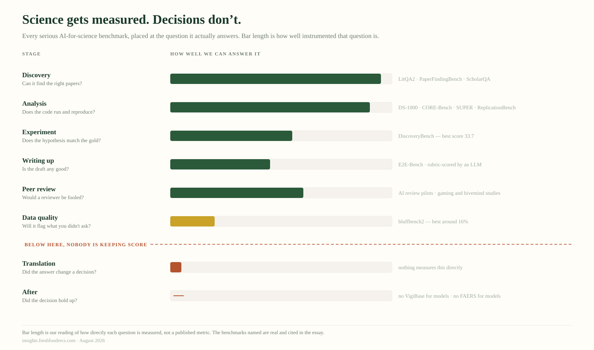

::: {.fi-tldr}
**The short version.** *Every claim here links to the source the full essay
cites — a summary that strips its provenance is doing the thing this piece
argues against.*

[Part 1](../the-health-gap/) counted 74,719 codes for what is wrong with you and
no agreed metric for whether you are healthy. That asymmetry repeats everywhere
downstream.

- **Surveillance.** [FDA Sentinel](https://www.sentinelinitiative.org/) watches
  ~138.7 million people; WHO's [VigiBase](https://who-umc.org/vigibase/) holds
  40M+ reports from 160+ countries. Both detect *harm*, in any product, in
  anyone. Benefit surveillance exists but is nothing like it: England's National
  PROMs Programme collects before-and-after outcomes on NHS joint replacement,
  and [HEDIS](https://www.ncqa.org/hedis/) grades health plans on benefit
  measures. Each is tied to a named procedure or condition. None is a general
  instrument.
- **Regulation.** For a new prescription drug, the maker must prove benefit before
  selling. For a
  supplement, [nobody proves benefit and the FDA must prove harm
  afterwards](https://ods.od.nih.gov/factsheets/DietarySupplements-Consumer/).
  The burden of proof inverts along the same axis.
- **Evaluation.** AI-for-science benchmarks are now rigorous —
  [57 agents, 2,400+ problems, a public leaderboard](https://arxiv.org/abs/2510.21652).
  Every one grades the machine's output. None grades whether a person decided
  better. The closest anyone has come,
  [bluffbench2](https://github.com/posit-dev/bluffbench2), asks whether an agent
  will flag a problem you didn't ask about; the best models manage around 16%.
- **Education.** We teach people to spot when something is *wrong*. Almost
  nothing about telling whether something is *working*. In
  [our own data](https://doi.org/10.1080/27697061.2026.2687436), 17 of 20
  carbohydrate foods are misread relative to expert consensus — and 70% are
  misread in both directions at once
  ([the per-food readout](../the-carb-education-gap/)).

**The consequence.** Stopping rules exist exactly where a validated surrogate
does. [Contrave's label](https://www.accessdata.fda.gov/drugsatfda_docs/label/2014/200063s000lbl.pdf)
says discontinue if the patient has not lost 5% of body weight by week 12;
[treat-to-target](https://ard.bmj.com/content/75/1/3) sets a number and a
review date; the [ATS time-limited trial](https://www.atsjournals.org/doi/10.1513/AnnalsATS.202310-925ST)
agrees in advance what improvement and deterioration will look like. Every one
needs a measure sitting on the causal path of a diagnosed condition. Below the
diagnostic threshold, outside the drug pathway, and across the whole positive-health
gradient, there is nothing to write a stopping rule against — so the default is
that you continue.

**What is worth building.** Not another consumer app, and not a new idea. A
decision artifact that travels between a person and their clinician — carrying
what was chosen, what was expected, what was uncertain, and what observation
would mean it was wrong. Roger Neighbour asked exactly this in 1987 — *"If I'm
right, what do I expect to happen? How will I know if I am wrong?"* — and UK
general practice has taught it ever since. It gets written down
[3% of the time](https://bjgp.org/content/69/689/e878). The gap is not the
concept. It is that nobody made it an object.

**The question that sorts the serious from the rest:** what would your product
have to observe to tell someone to stop using it?
:::

[Part 1](../the-health-gap/) counted 74,719 codes in ICD-10-CM for what is wrong
with you, against no agreed metric for whether you are healthy. I called that the
health gap and argued it was a measurement problem before it was anything else.

Since then I have been mapping the organizations that sit between published
evidence and somebody acting on it. I expected to find the gap there too.

I did — three times, in three different eras of infrastructure. What I did not
expect was that it explains something I had been treating as an unrelated
puzzle, and that the fix is more tractable than closing the original gap.

## The surveillance we did build

Start with the part that works. When a drug reaches the market, an apparatus
turns on behind it that is genuinely impressive.

The FDA's Sentinel network has roughly **138.7 million members currently
accruing data**. The World Health Organization's VigiBase holds **over 40 million
individual case safety reports** from more than 160 countries. Uppsala Monitoring
Centre, which runs it, has run algorithmic signal detection in production since
**2014** — not as a demonstration, as plumbing — because signal detection turned out to be a
well-posed problem with labels, volume and a cost function.

Every one of those systems detects when something went **wrong**.

Sentinel finds adverse events. VigiBase collects adverse reactions. Veeva's
platform manages safety signals. The MHRA's Yellow Card takes adverse incident
reports, now including software and AI. Epic's Seismometer watches deployed
clinical models for degradation.

Not one detects whether something went **right**.

Benefit surveillance is not absent — and an earlier version of this essay said it
was, which was wrong.[^benefit] England's National PROMs Programme collects
before-and-after patient-reported outcomes on NHS-funded joint replacement, at
national scale, linked to the National Joint Registry. HEDIS grades health plans
on benefit measures across US managed care. ICHOM publishes standard outcome sets
by condition.

But look at what each one needs before it can start. A named procedure or a named
condition, a defined population already inside the system, and an agreed outcome
for that specific thing. Sentinel needs none of that. It watches any product in
anyone and asks a question — *did something go wrong?* — that can be posed
without knowing in advance what you were hoping for.

That is the asymmetry, stated more carefully than I stated it the first time. Harm
surveillance is **general**; benefit surveillance is **enumerated**. One scales to
things nobody anticipated. The other has to be built one condition at a time, by
someone who already agreed what better means — which is the thing Part 1 said we
do not have a general answer to.

The arithmetic makes the point sharper than the examples do. The FDA lists more
than 200 surrogate endpoints it has accepted as a basis for approval. Its
Biomarker Qualification Program, the formal route for establishing a *new*
measure, has qualified **eight** since it began.[^biomarker] The stock of ways to
measure benefit is large and essentially fixed. The pipeline for adding to it is
closed.

## The burden of proof inverts

The surveillance asymmetry is not an accident of what was easy to build. It is
written into the law, and the clearest statement of it comes from the National
Institutes of Health.

> "Unlike drug products, there are no provisions in the law for FDA to approve
> dietary supplements for safety or effectiveness before they reach the
> consumer. Once a dietary supplement is marketed, FDA has to prove that the
> product is not safe in order to restrict its use or remove it from the
> market."[^ods]

Read that twice. For a new prescription drug, the manufacturer must demonstrate
**benefit** before anyone can sell it. For a supplement, nobody demonstrates benefit at all, and the
regulator must demonstrate **harm** afterwards.

The burden of proof inverts, and it inverts along exactly the axis this essay is
about. On one side of the line somebody has to prove the positive pole. On the
other, nobody does — and the only question anyone is ever obliged to answer is
whether it hurt you.

This is why the surveillance apparatus looks the way it does. For the products
people take on their own initiative, in the categories where "should I still be
doing this?" is the live question, **there was never a benefit claim on record to
revise against.** You cannot detect that something stopped working if nothing
ever established that it worked.

Newer categories sit in stranger territory still — compounded peptides and
research chemicals move through channels where neither the drug bar nor the
supplement framework applies cleanly. I am not going to characterise that
regulatory position precisely, because I have not verified it to the standard
this essay demands of everyone else. But the direction is not in doubt: the
further a product sits from the drug approval pathway, the less anyone ever had
to show it does anything.

And none of this reaches the person deciding. Someone choosing between a
prescription, a supplement and a peptide is choosing between three completely
different evidence regimes, and nothing in the purchase tells them which one they
are in.

## And again in the newest infrastructure

I found it a third time in the place I least expected, which is where I spent
most of this month.

AI for science now has serious evaluation. The Allen Institute for AI put 57
agents across 22 agent classes against more than 2,400 problems, on a public
leaderboard, with tooling standardised so comparisons are fair and prices frozen
so nobody buys their way up the table.[^asta] It is refreshingly unflattering: in
the paper, the best agent scores 53.0 overall, and on data analysis nothing beats
33.7. The live leaderboard has since moved past both — which is the point of
having one.

Here is what all eleven of those benchmarks measure. Whether the agent found the
right papers. Whether the code ran. Whether the reproduction matched. Whether the
summary was faithful.

Every one scores an artifact the machine produced. I checked rather than assumed:
across eighty-eight pages, scoring partitions cleanly into an LLM judging output
against a rubric, or a program checking output against a reference. The words
*downstream*, *user study* and *decision quality* never appear.

{fig-alt="Eight stages from discovery to after-translation, each with a bar showing how well instrumented it is. Long bars for discovery and analysis, shorter through experiment and peer review, short for data quality, near-zero for translation and after, below a dashed line reading 'below here, nobody is keeping score'."}

One team has got closest. Posit's bluffbench2 does not ask whether an agent can
make a chart; it asks whether the agent will tell you something is wrong with
your data *when you did not ask*.[^bluff] Across 26 scenarios — a stuck sensor, a
bad join, swapped columns, imputed values sitting neatly on a fitted line — the
best models manage around 16%.

The finding underneath is more interesting than the number, though it is softer
than I first reported it. Models sometimes added a fitted line without being
asked, which is reasonable and idiomatic. Posit's own writeup, from reading the
logs rather than running a controlled comparison, says doing so *"seems to
substantially lower the chances that the model will notice the plotted
artifact."* Their hedge, and it should be mine.[^bluff]

If it holds, the mechanism is worth sitting with. The smoother did what smoothers
do. It made the picture look like a relationship, and the model believed its own
chart.

Not a capability failure and not deception. A plausible default that quietly hid
the thing which would have invalidated the result, in a system with no way to
notice it had been hidden.

## What the asymmetry costs

Three domains, one shape. Diagnosis instruments sickness in general and health
not at all. Surveillance instruments harm in general and benefit only where
someone has already enumerated it. Evaluation instruments output and not
decisions.

Follow that downstream to a person and something specific breaks. Surveying the
organizations between evidence and action, the last thing anyone does is
*revise* — find out the thing is not working, and stop.

Nothing in that survey occupies it. The qualifier matters, and I will be exact
about it below.

I want to be careful here, and specific about where that comes from. I have
spent this month criticising landscape maps that publish tag counts as findings,
so I am not going to quote my own. The count rests on a taxonomy whose stage
definitions I only wrote inclusion tests for after the current release was
published; the released map does not yet reflect them, and the next one
will.[^provenance] So take the smaller, checkable version instead:

**Of the organizations sitting between evidence and action, one produces a
decision artifact you could re-read a year later, and none records in advance
what would make you stop.**

The one is MDCalc. Its calculators ship with the derivation study, the validation
lineage, and commentary from the person who built the score. It predates all of
this and it is not AI.

Now the qualifier, because without it that sentence overclaims. *In this survey*
is doing real work. The survey covers organizations building at the interface of
AI, evidence and consumer health. Stopping rules are a solved problem one frame
over — in rheumatology, in oncology, in the ICU — and I will come to why that
does not rescue the person this essay is about.

## Why nothing stops you

The chain is short, and it has one link I got wrong the first time.

Revision needs a stopping rule. A stopping rule needs to know whether the thing
is working. That needs a measure of benefit — and where such a measure exists,
medicine writes stopping rules readily and has for decades.

Rheumatoid arthritis has a disease activity score, so treat-to-target sets a
number and a review date. Oncology has RECIST, so progressive disease is defined
before treatment starts. Contrave's FDA label instructs the prescriber to
discontinue if the patient has not lost 5% of body weight by week 12 — a stopping
rule, in the label, written by the regulator, for a weight-loss drug.

So the honest claim is not that medicine cannot say stop. It is that **the ability
to say stop is exactly coextensive with having a validated surrogate**, and
validated surrogates exist for diagnosed conditions with a single dominant
pathway. That covers a great deal of medicine and almost none of health.

The person this essay is about is below the diagnostic threshold, taking something
that never sat on an approval pathway, pursuing something — more energy, better
sleep, aging well — for which no surrogate was ever qualified and, given eight in
the program's lifetime, is unlikely to be. For them the empty cell is not a market
oversight. It is the health gap followed far enough downstream to reach one person
deciding whether to keep taking the supplement.

It also explains the shape of what *is* there. The organizations near the
decision are primary care practices, supplement brands, wearable companies and
subscription apps. Every one is built to start you on something and sustain you
on it. None is built to stop you — and it would be odd if any were, since
stopping requires a measure nobody has, and a subscription that ends is a
subscription that ends.

I should be honest about my own work here. FRESH scores foods. It can say a great
deal about what is in something and how the evidence stacks up. It cannot
currently tell you to stop doing what it told you six months ago, because that
needs the same missing measure. Naming a gap you are standing in is
uncomfortable and it is the only honest position available.

## What the good artifact actually does

It is worth looking closely at the one thing that passed, because it shows the
standard is reachable.

MDCalc hosts the PREVENT equations — the American Heart Association's
cardiovascular risk model, which replaced the Pooled Cohort Equations that had
governed statin decisions for a decade. The page carries what you would want:
what it estimates, an evidence section, creator commentary, guidance on use.

It also carries the thing I expected to find missing. The first line of its
Pearls and Pitfalls says the tool "updates and replaces the AHA/ACC Pooled
Cohort Equations published in 2014," and its references include head-to-head
comparisons against them.[^prevent]

So the artifact carries its derivation *and* its revision history. A clinician
opening it can see where PREVENT came from and that it superseded something.
That is not nothing — it is the only place in this essay where the capability I
have been describing already exists.

What it does not carry, and what nothing carries, is the consequence. Knowing
that one equation replaced another is different from knowing what the swap did
to a specific person's recommendation. That is the subject of Part 3, because
when one equation replaces another the effect is not academic. It moves who is
treated.

## And the reader has to exist

There is a third prerequisite, and it is the one I am least comfortable with,
because our own data speaks to it directly.

A decision artifact carrying options, effect sizes and a stopping rule
presupposes somebody who can read one. So before proposing it, it is worth
asking what people currently do with the far simpler signal we already give
them.

We asked consumers to rate twenty carbohydrate foods for healthfulness and
compared their beliefs against a pooled expert consensus.[^carb] **Seventeen of
the twenty land at Alignment Grade C or D** — far from where the experts sit.
Only two, an apple and a soda, actually line up.

But the interesting part is not the size of the gap. It is the structure.

The misses are not random and they are not uniform ignorance. The public is
consistently *harder* on carbohydrate foods than the people who study them —
every potato food, including a plain baked potato, is read as less healthy than
experts rate it. Honey runs the other way, read as far healthier. The two juices
invert: a sugary "vitamin C" drink earns a health halo while genuine 100% juice
gets marked down. And **seventy percent of the foods carry misperception in both
directions at once** — white rice splits almost evenly.

That last number changes what education means here. This is not a deficit to be
filled by telling people more. It is a specific, food-by-food set of beliefs,
several of which point in opposite directions simultaneously. "Raise health
literacy" is the wrong instrument for that, in the same way that "raise
awareness" is the wrong instrument for a measurement problem.

And notice the asymmetry has an educational twin. We teach people to recognise
when something is **wrong** — symptoms, warning signs, the list of things that
mean call a doctor. We teach almost nothing about how to tell whether something
is **working**. Ask most people what would make them stop a supplement and the
honest answer is *if it gave me side effects* — which is, once again, the harm
pole. There is no widely taught vocabulary for benefit, no everyday sense of
what a small effect looks like, no intuition for the difference between a
relative and an absolute risk.

So we have three missing prerequisites, not one:

1. **A benefit measure to put in the artifact** — Part 1's gap.
2. **An obligation on anybody to produce one** — the inverted burden of proof.
3. **A reader who can interpret it** — the numeracy gap, which our own data
   suggests is structured rather than general.

Any one of those alone would be a hard problem. Together they explain why the
last stage is empty better than any market story does.

## What is actually worth building

This is where I stop diagnosing, because the shape of the opportunity is
unusually clear and it is not another app.

There are two decision surfaces and they do not connect.

**The professional one exists** and is thin but real: MDCalc, GRADE, guideline
tooling, the calculators clinicians actually open mid-visit. It is
evidence-linked, it has standards, and it has an installed base.

**The consumer one does not exist at all.** People make more health decisions
outside a clinic than inside one — what to eat, what to take, what to stop, what
a wearable reading means — and the tools they reach for are optimised for
engagement rather than for deciding. Nothing hands them options, effect sizes and
uncertainty in a form they could re-read later. Nothing tells them what would
count as this-is-not-working.

The valuable thing is not a better consumer app. It is a **decision artifact that
travels between the two** — built for a person, legible to a clinician, carrying
what was chosen, what was expected, what was uncertain, and what observation
would mean it was wrong. Something a person arrives at an appointment holding,
that a clinician can read in fifteen seconds and act on.

That is not new science, and — I want to be straight about this, because the first
version of this essay implied otherwise — it is not a new idea either.

It is pre-registration applied to a person instead of a study, and medicine has
pointed pre-registration at the individual for forty years. The n-of-1 trial does
it formally, with its own reporting standard since 2015. The ATS time-limited
trial does it in the ICU, with sixteen specified elements including what
improvement and deterioration will look like. Roger Neighbour put the whole thing
in three sentences in 1987, and British GPs have been taught them ever since.
Last year a team published a paper-based ICU care plan carrying the chosen
therapy, three expected-outcome scenarios and a reassessment date, co-designed
with the families who asked to keep copies.[^priorart]

So the correct claim is not that nobody thought of this. It is that everybody
thought of a piece of it, several people built it, and none of it stuck. Time-limited
trials appear in 1% of goals-of-care notes. Safety netting gets written down 3% of
the time. The Mayo decision aids run in 7% of eligible encounters. Best Case/Worst
Case was sustained at one of eight trauma centres a year after the trial ended.

What is genuinely unoccupied is narrower, and stating it narrowly is the only way
to be useful: **all four fields, in one filled-in object, for an ordinary decision
rather than a critical-illness one, in the person's custody, where the trigger is
an observation rather than a date on the calendar.** Every existing artifact makes
the same substitution — POLST, ReSPECT, NICE's shared-decision standard and
Australia's chronic-condition plan all give you a review *date* where you wanted a
review *condition*. That systematic swap is itself the finding.

And it has to be built so the third prerequisite is not assumed. This is the
part most likely to be skipped, because it looks like design polish and is
actually load-bearing. If seventeen of twenty foods are misread at the level of
*is this healthy*, an artifact expressing a stopping rule as a hazard ratio will
not land — and the failure will look like the user's fault when it is the
instrument's.

Which means the artifact has to teach as it works. Not a literacy campaign
running alongside it, and not a tutorial nobody opens: the numbers have to arrive
in a form that carries their own interpretation. Absolute effects rather than
relative ones. Natural frequencies rather than percentages. The comparison
alongside the claim, so *better than what* is answered on the same screen. What
would have to be observed for this to be wrong, stated in advance, in terms the
person could actually notice.

Done that way, a person using it learns what an effect size is by encountering
one that matters to them — which is the only mechanism I have ever seen work. It
is also, not incidentally, the same discipline the map holds itself to: state the
uncertainty, publish the limits, say what would falsify it.

Part 1 ended on this from the other direction — that the methodological gap sits
on top of an educational one, and we have not built the scaffolding that makes
the conversation possible. I would put it more narrowly now. We do not need
everyone to become numerate in the abstract. We need the artifact to be readable
by the person holding it, and we need to stop pretending that is somebody else's
department.

If you are building anywhere near this, the question that separates the serious
from the rest is not how accurate your model is. It is:

**What would your product have to observe to tell someone to stop using it?**

Most cannot answer. A few will say they never would, which is at least honest.
The ones with an answer are worth watching, and I have not found many.

## The closer

We built a global apparatus to detect when medicine harms people. Across 160
countries and 40 million reports, and we should be proud of it. We built the other
half too — but only one condition at a time, only for people already diagnosed,
and only where somebody had first agreed what better would look like.

Which leaves everyone else. If you are below the threshold, or taking something
that never sat on an approval pathway, or chasing something no biomarker was ever
qualified for, nobody can tell you whether it is working, which means nobody can
tell you to stop, which means the default is that you continue.

Not because anyone decided that. Because of what got measured.

If you have been working on the other pole — a benefit signal, a stopping rule,
an outcome that means *this can end now* — I still want to hear from you. Part 1
asked and people reached back. The map is partly a record of who did.

> **Information can be health. But only if something is watching for the part
> that goes right.**

---

*Part 3 takes the case Part 1 promised, and it now has a home: PREVENT sits
inside the one decision tool that survived this essay's own test. When it
replaced the Pooled Cohort Equations in 2023, it may have silently halved the
value ceiling for every cardiovascular intervention. MDCalc records that the swap
happened. What no tool records is what the swap did to the person in front of
you.*

**If you want to go deeper:**

- Part 1, and the 74,719 codes: [We Measure Sickness, We Mean Health](../the-health-gap/)
- The living map, published with its own audit: [AI-for-Science Ecosystem Map](../ai-for-science-map/)
- AstaBench (Allen Institute for AI): <https://arxiv.org/abs/2510.21652>
- Posit's bluffbench2: <https://github.com/posit-dev/bluffbench2>
- FDA Sentinel: <https://www.sentinelinitiative.org/>
- WHO VigiBase (Uppsala Monitoring Centre): <https://who-umc.org/vigibase/>

[^asta]: Bragg, D'Arcy, Balepur, et al. (39 authors), "AstaBench: Rigorous Benchmarking of AI Agents with a Scientific Research Suite," arXiv:2510.21652, ICLR 2026. Thirty-seven of the thirty-nine authors list the Allen Institute for AI; the other two did the work there. *(Corrected 2026-08-01 from "thirty-five".)* The Overall Score is a macro-average of four category scores built from incommensurable sub-metrics — **not** a percentage of problems solved. Best overall 53.0 ± 2.4 at $3.40 per problem; best on data analysis 33.7 ± 5.1 — that figure belongs to ReAct with o3, not to a purpose-built data-analysis agent. Both are the paper's numbers; Ai2's April 2026 leaderboard update reports higher scores since, which is what a live leaderboard is for.

[^bluff]: Posit, "bluffbench2": <https://github.com/posit-dev/bluffbench2> (MIT), written up at <https://opensource.posit.co/blog/2026-07-17_ai-newsletter/>. 26 scenarios, two epochs per model, R with `vitals`. Graded C (flagged unprompted) / P (after a nudge, counted half) / I (missed); the figure is C plus half of P. Read current scores off the repo — they move as models update. **Correction, 2026-08-01:** this essay first stated flatly, in bold, that adding a fitted line made models less likely to notice the artifact. The source hedges — *"seems to substantially lower the chances"* — and the observation comes from reading eval logs, not from a controlled comparison. The repository publishes no per-artifact breakdown and no ablation. I have restored the hedge. **Disclosure:** this essay is co-authored with an AI assistant, and that model is one of the models bluffbench2 scores. Cite the benchmark, not the ranking.

[^benefit]: **Correction, 2026-08-01.** This essay first published the sentence *"There is no Sentinel for benefit. There is no VigiBase of things that worked."* That was wrong, and it was the load-bearing sentence of the section. England's National PROMs Programme collects pre- and post-operative patient-reported outcomes on NHS-funded hip and knee replacement — see, for one use of the linked data, [Patel et al., *PLoS Medicine* 2026;23(2):e1004870](https://doi.org/10.1371/journal.pmed.1004870). [HEDIS](https://www.ncqa.org/hedis/) reports benefit measures across US managed care. [ICHOM](https://www.ichom.org/patient-centered-outcome-measures/) publishes standard outcome sets by condition. I have rewritten the section around the claim that survives — that harm surveillance is general and benefit surveillance is enumerated — rather than deleting the error, because an essay arguing that provenance should survive summarisation cannot quietly revise its own. NHS Digital's own PROMs pages sit behind a bot challenge, so I have cited a peer-reviewed use of the data rather than a link I could not verify.

[^biomarker]: FDA's [table of surrogate endpoints](https://www.fda.gov/drugs/development-resources/table-surrogate-endpoints-were-basis-drug-approval-or-licensure) that were the basis of approval or licensure lists well over 200 entries across adult and pediatric indications; the [Biomarker Qualification Program](https://www.fda.gov/drugs/drug-development-tool-ddt-qualification-programs/biomarker-qualification-program), the formal route to establishing a new one for general use, lists a single-digit number of fully qualified biomarkers since it began. The two counts are not strictly commensurable — approval-basis endpoints accumulate per indication while qualification is a general-use determination — which is itself the point: the easy path is to reuse a measure somebody already accepted, and the deliberate path to a genuinely new one is close to unused.

[^priorart]: The prior art, in the order it arrived. Roger Neighbour, *The Inner Consultation* (MTP Press, 1987), asks *"If I'm right, what do I expect to happen? How will I know if I am wrong? And what would I do then?"* — taught in UK general practice as safety netting; [Edwards et al., *BJGP* 2019;69:e878](https://bjgp.org/content/69/689/e878) video-recorded 318 consultations and found it delivered verbally in 96.9% of cases and written down for 8 problems out of 257. [CENT 2015](https://pubmed.ncbi.nlm.nih.gov/26272792/) is the reporting standard for n-of-1 trials; the [NAM's own assessment](https://nam.edu/perspectives/expanding-the-role-of-n-of-1-trials-in-the-precision-medicine-era-action-priorities-and-practical-considerations/) is that they are "far from standard practice in clinical medicine." The [ATS 2024 consensus statement](https://www.atsjournals.org/doi/10.1513/AnnalsATS.202310-925ST) defines the time-limited trial; Piscitello et al., *Journal of Pain and Symptom Management* 2025, found them referenced in about 1% of goals-of-care notes across 21 hospitals. Mortenson et al., "The ICU Care Plan," *JAGS* 2025;73:3747, is the closest existing object to what this section proposes — a paper template carrying the therapy, three outcome scenarios and a reassessment date, co-designed with 28 patients, surrogates and physicians. It is at prototype stage. Two naming hazards worth flagging for anyone building here: "pre-registration" already means insurance intake in US healthcare, and "premortem" already means before death.

[^prevent]: MDCalc's "Predicting Risk of Cardiovascular Disease EVENTs (PREVENT)" calculator (calc 10491), estimating 10- and 30-year CVD risk in adults aged 30–79 without known CVD. **Correction, 2026-08-01:** this essay first published claiming the page made no reference to the Pooled Cohort Equations. That was wrong. My initial check used a fetch that silently missed MDCalc's client-rendered sections; reading the raw page shows the Pearls and Pitfalls opening line, and PCE head-to-head references. The error was mine, the correction changes the section's conclusion, and I have left the original claim described here rather than quietly deleting it.

[^carb]: Erndt-Marino & Ghirardelli, "Educational Gaps and Communication Priorities for the Healthfulness of Carbohydrate Foods," *Journal of the American Nutrition Association*, 2026, DOI [10.1080/27697061.2026.2687436](https://doi.org/10.1080/27697061.2026.2687436), open access. The Alignment Grade scores the *size* of the consumer–expert gap, A through D, regardless of direction. Longer treatment, with the per-food readout: [The Carb Education Gap](../the-carb-education-gap/). The expert side is a pooled meta-NPS consensus, which carries its own disagreement — twenty foods is also a small set, and these are US consumers.

[^ods]: NIH Office of Dietary Supplements, "Dietary Supplements: What You Need to Know," <https://ods.od.nih.gov/factsheets/DietarySupplements-Consumer/>, fetched 2026-08-01. The framework is the Dietary Supplement Health and Education Act of 1994. Ingredients sold before 15 October 1994 are presumed safe on history of use; new dietary ingredients require notification rather than approval. I fetched this from NIH rather than FDA because fda.gov blocks automated requests — a limitation worth stating rather than hiding.

[^provenance]: Stated plainly because it matters for an essay about unsupported claims. The observation comes from applying written stage-inclusion tests by hand to the organizations in the survey — under those tests, the entities I had coded into a *decide* stage collapse from seven to one, because six of them are primary-care businesses, and a clinic is where deciding happens rather than a decision instrument. The tests are now [published in full](../ai-for-science-map/method.html), with the worked reclassification and what applying them costs us. They were written after the current release shipped, so the [map itself](../ai-for-science-map/) does not yet reflect them and MDCalc is not in it; the September release applies them. So the claim rests on the method rather than on the current build — which is a weaker source than I would like, and stating that is better than linking you to an artifact that does not support it.

